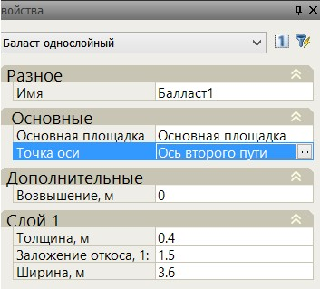

# Балласт

## Балласт на основной площадке

Балласт на основной площадке может быть однослойный, двуслойный и трехслойный. Параметры трехслойной балластной конструкции представлены на схеме ниже:

* 1 - Толщина.
* 2 - Толщина первого слоя.
* 3 - Толщина второго слоя.
* 4 - Смещение первого слоя.
* 5 - Смещение второго слоя.
* 6 - Заложение откоса.
* 7 - Заложение откоса первого слоя.
* 8 - Заложение откоса второго слоя.

## Балластная призма

Балласт без основной площадки может задаваться либо как обычная балластная призма, либо как балластная призма в корыте.

* 1,2 - Заложение откоса.
* 3 - Заложение откоса досыпки.
* 4,5 - Минимальная ширина обочины слева, справа.
* 6 - Фактическая ширина обочины.
* 7 - Максимальная высота досыпки.
* 8,9 - Уклон основания слева, справа.



Толщина балласта определятся под внутренним рельсом.



## Балластная призма в корыте (балласт полностью погруженный в корыто)

Данный элемент конструкции задается следующим набором параметров:

* 1 - Толщина.
* 2 - Заложение откосов.
* 3 - Уклон основания слева.
* 4 - Уклон основания справа.
* 5 - Заложение откоса корыта слева.
* 6 - Заложение откоса корыта справа.
* 7,8 - Ширина корыта слева, справа.
* 9 - Ширина.

### Балласт частично погруженный в корыто

* 1 - Толщина.
* 2 - Заложение откосов.
* 3 - Уклон основания слева.
* 4 - Уклон основания справа.
* 5 - Заложение откоса корыта слева.
* 6 - Заложение откоса корыта справа.
* 7,8 - Ширина корыта слева, справа.
* 9 - Ширина.

Программа позволяет проектировать балласт как на совмещенном так и на раздельном земляном полотне. По умолчанию при вставке балласт привязывается к оси текущего подобъекта.

При добавлении второго балласта он так же установится на ось текущего подобъекта. Для того что бы перенести его на соседний путь, необходимо выбрать ось второго пути в поле Точка оси стандартного окна **Свойства**.

Осью второго пути может являться как ось соседнего подобъекта, отображаемая на поперечнике, так и точка второго пути, автоматически созданная в конструкции основной площадки при задании междупутья.

#### Механизм проектирования досыпки

Механизм проектирования досыпк следующий:

1. Основание с заданным уклоном продлевается до пересечения с черной землёй (т.е. существующая черная земля срезается по линии основания).
2. Затем сравниваются получившиеся фактические ширины обочин со значениями минимальных ширин обочин слева и справа. Если фактическая ширина обочины больше минимальной, то конструкция остается неизменной. Если же фактическая ширина обочины меньше минимальной, то осуществляется досыпка с заданным уклоном.
3. Если необходимая высота досыпки больше максимальной, то досыпка не осуществляется и программа выдает ошибку. В этом случае необходимо изменить проектное решение.

* 1 - Максимальная высота досыпки.
* 2 - Фактическая высота досыпки.