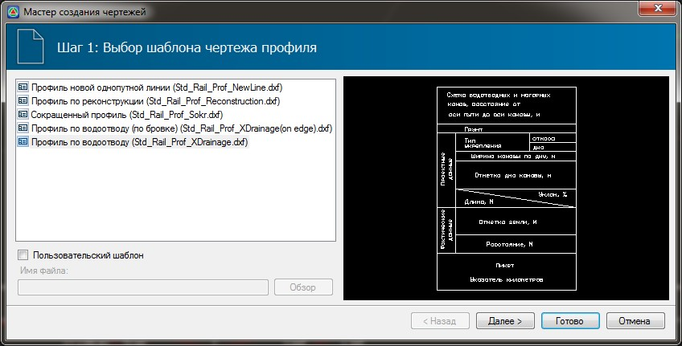
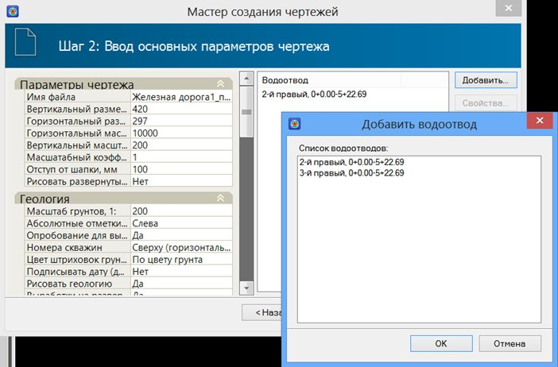
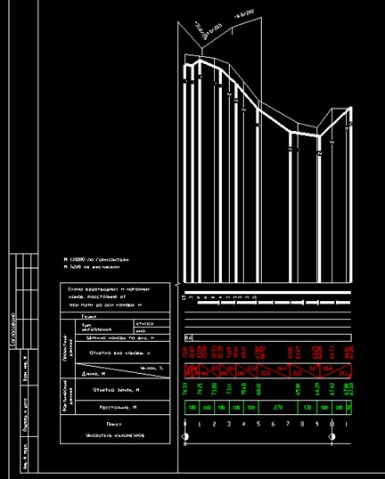

# Создание чертежа профиля водоотвода

Для того, чтобы создать чертеж продольного профиля по водоотводу выполните следующие действия:

1. Выберите элемент меню **Проект – Создать чертеж – Продольный профиль**. Откроется окно **Мастер создания чертежей** :

   

2. Выберите cтандартный шаблон продольного профиля по водоотводу (Std\_Rail\_Prof\_ XDrainage.dxf).

   

   При выборе шаблона продольного профиля по водоотводу **Std\_Rail\_Prof\_XDrainage. dxf** в графе чертежа **Фактические данные** будут выноситься отметки **Черного профиля**. В случае использования шаблона продольного профиля по водоотводу **Std\_Rail\_Prof\_XDrainage (on edge).dxf** в графе чертежа **Фактические данные** будут выноситься отметки бровки водоотводного сооружения.

   

3. Нажмите **Далее**. Откроется диалоговое окно:

   

   Данное окно поделено на две части.

   В левой части окна задаются основные параметры чертежа. Такие как: **масштаб, размер шрифта, размер листа, отступ от шапки чертежа** и т.п.

   В правой части окна выбирается список водоотводов, по которым будут создаваться чертежи.

4. Для добавления водоотводов в список нажмите кнопку **Добавить**. В появившемся диалоговом окне выберите участки, которые должны быть отражены на чертеже.
5. Нажмите **OK**.
6. После выбора участков водоотвода, нажмите кнопку **Готово**.

В результате программа сформирует чертежи выбранных участков водоотводов.

