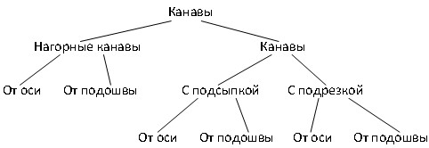

# Канавы

Классификация канав в насыпи по их типам схематично показана ниже:

При вставки канавы необходимо указать на поперечнике откос, к которому она будет привязана.

## Канава с подсыпкой от оси

Данный тип канавы задается следующим набором параметров:

* 1 - Расстояние от оси.
* 2 - Глубина канавы.
* 3 - Ширина дна канавы.
* 4,5 - Заложение внутреннего и внешнего откоса.
* 6 - Уклон полки.

## Канава с подсыпкой от подошвы

В данном случае, привязка канавы осуществляется заданием ее расстояния от подошвы насыпи.

* 1 - Расстояние от подошвы.
* 2 - Глубина канавы.
* 3 - Ширина дна канавы.
* 4,5 - Заложение внутреннего и внешнего откоса канавы.
* 6 - Уклон полки.

## Канава с подрезкой от оси

Данный тип канавы задается следующим набором параметров:

* 1 - Расстояние от оси.
* 2 - Глубина канавы.
* 3 - Ширина дна канавы.
* 4,5 - Заложение внутреннего и внешнего откоса.
* 6 - Уклон полки.

## Канава с подрезкой от подошвы

В данном случае, привязка канавы осуществляется заданием ее расстояния от подошвы насыпи.

* 1 - Расстояние от подошвы.
* 2 - Глубина канавы.
* 3 - Ширина дна канавы.
* 4,5 - Заложение внутреннего и внешнего откоса.
* 6 - Уклон полки.

## Канава с подрезкой от подошвы существующей насыпи

Добавление данной конструкции производится путем указания точки вставки в качестве которой может быть использован как любой узел конструкции, так и существующая точка с кодом.

Схема см. выше Канава с подрезкой от подошвы.

Укрепление канав схематично показано ниже:

* 1,2 - Высота внутреннего и внешнего укрепления.
* 3,4 - Толщина укрепления внешнего и внутреннего откоса.
* 5 - Толщина укрепления дна канавы.
* 6,7 - Заложение внешнего и внутреннего откоса укрепления.

## Нагорная канава

Аналогично стандартной канаве задается привязкой от оси или от подошвы. Привязка нагорной канавы от оси задается следующим набором параметров:

* 1 - Расстояние от оси.
* 2 - Глубина канавы.
* 3 - Ширина дна канавы.
* 4,5 - Заложение внутреннего и внешнего откоса.

Привязка нагорной канавы от подошвы задается следующим набором параметров:

* 1 - Расстояние от подошвы.
* 2 - Глубина канавы.
* 3 - Ширина дна канавы.
* 4,5 - Заложение внутреннего и внешнего откоса.



У всех водоотводных элементов есть дополнительный параметр - **Профиль назначения**. Описание данного параметра будет рассмотрено в разделе [Водоотвод](drains.md).

