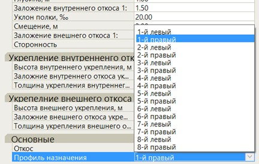
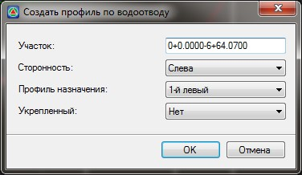
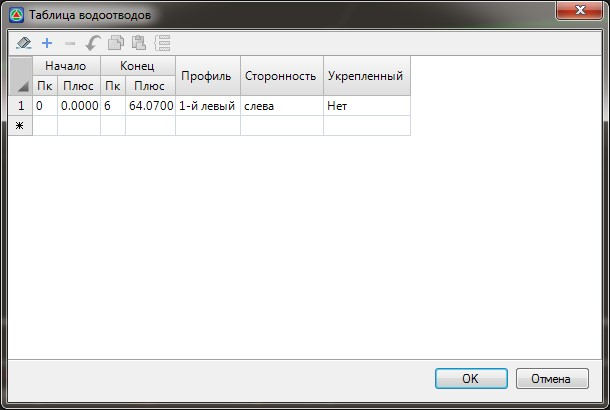
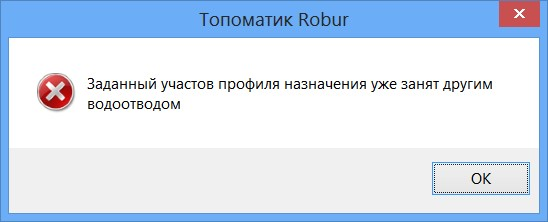
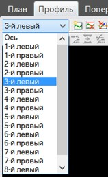
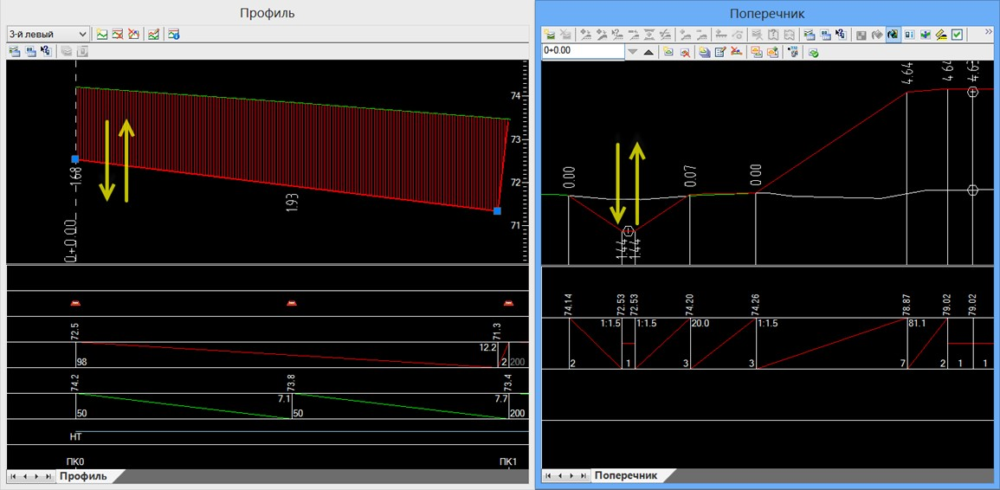

# Водоотводы

Данный модуль предназначен для проектирования водоотводных устройств (канавы, кюветы, лотки). Он позволяет выбрать соответствующие типы водоотводных устройств и задавать их параметры, как на продольном, так и на поперечном профиле. В качестве выходного документа формируется чертеж водоотвода.

Обычно водоотвод проектируется в следующей последовательности:

1. Выбирается участок и элемент поперечника на котором на котором должен быть запроектирован водоотвод.
2. Создается продольный профиль водоотвода.
3. Происходит редактирование продольного профиля для обеспечения отвода воды к водоприемным сооружениям.

Теперь рассмотрим каждый шаг подробнее:

1. Если в окне **Поперечник** выделить конструкцию канавы или кювета, то у них в окне **Свойства** будет присутствовать пункт «**Профиль назначения**». В данном поле выбирается профиль, по которому будет проектироваться водоотвод. При необходимости с помощью селектора выбора, профиль можно поменять на любой другой.

   

   

   При создании водоотводных сооружений из пользовательских элементов конструкций - **Узлов, Лучей** и **Контуров** и необходимости проектирования профиля водоотвода по созданной конструкции, необходимо привязать профиль водоотвода к узлу конструкции, для этого:

   1. Выберите необходимый узел созданной конструкции водоотводного сооружения и нажмите правой кнопкой мыши.
   2. Выберите пункт меню **Связать узел** с профилем водоотвода, далее выберите профиль назначения.

   

2. Профиль водоотвода создается по уже законструированным поперечникам. Существует два способа создания профиля водоотвода:

   * Для последовательного создания профиля одного водоотвода по поперечникам выберите элемент меню **Задачи- Создать водоотвод по поперечникам**. Появится окно создания профиля водоотвода:

     

     * **Участок** - в данном поле задаются пикеты границ участка проектируемого водоотвода.
     * **Сторонность** - выбирается из выпадающего списка. **Сторонность** принимается относительно направления пикетажа трассы.
     * **Профиль назначения** - из выпадающего списка выбирается номер профиля, который будет использоваться для проектирования водоотвода с левой или правой стороны.
     * **Укрепленный** - в зависимости от выбранного параметра - **Да\Нет**, линия водоотвода в окне **План** будет отображаться соответствующим условным знаком.

   Задайте необходимые параметры для создания водоотвода и нажмите **ОК**.

   В результате программа создает продольный профиль водоотвода на заданном участке и автоматически заполнит **Таблицу водоотводов**:

   

   

   Если при создании нового участка водоотвода, на данном продольном профиле и соответствующих пикетах уже назначен другой участок водоотвода, то программа выдаст соответствующее предупреждение:

   

   

   * Второй способ заключается в непосредственном редактировании таблицы водоотводов. В этом случае можно одновременно создать несколько водоотводных участков. Для этого:

     Выберите элемент меню **Задачи - Водоотводы - Таблица водоотводов**. Откроется основная таблица, в которой будет представлен общий список водоотводов, которые содержит текущая трасса. Если предварительно никаких водоотводов не создавалось, то данная таблица будет пустой:

     

     Заполните в данной таблице пикеты участков и профиля, на которых необходимо создать водоотводы и нажмите **ОК**.

     В результате программа создаст по поперечникам (по элементам которые имеют такой же профиль привязки), на соответствующих участках профили водоотводов и «привяжет» к ним данные элементы поперечника. Т.е., к примеру, при дальнейшем редактировании профиля водоотвода глубина элемента **Канава** будет автоматически меняться.

Для удаления водоотвода на заданном участке откройте выше описанную таблицу водоотводов и удалите в ней соответствующую строку. При этом будет удален продольный профиль данного участка и его связь с конструкцией поперечника.

Для редактирования продольного профиля водоотвода сделайте его текущим в окне **Профиль** с помощью специального селектора:

Для редактирования водоотвода доступен весь набор функций по работе с основным продольным профилем.



Данный функционал был описан ранее в разделе [Продольный профиль](../rail_profile/projecting_longitudinal_profile.md).



При редактировании профиля водоотвода автоматически меняются отметки и глубины конструкций поперечника, которые к ним привязаны.

Однако, изменение параметра конструкции **Глубина** через диалоговое окно **Свойства**, не приводит к соответствующему изменению профиля водоотвода. При необходимости редактирования параметров водоотвода непосредственно на поперечнике, профиль водоотвода на соответствующем участке необходимо удалить.