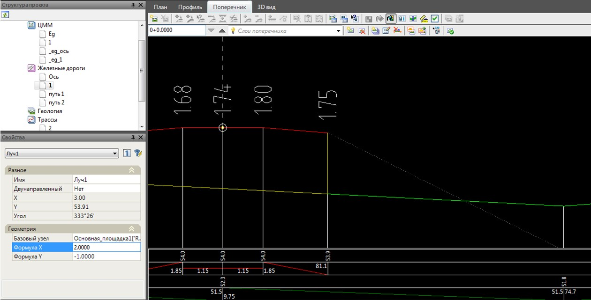
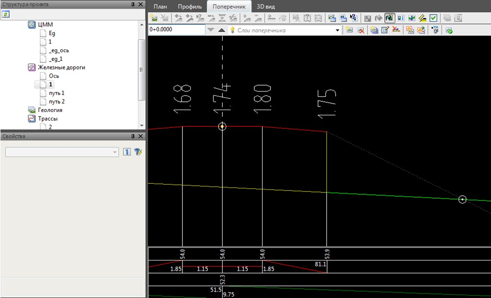
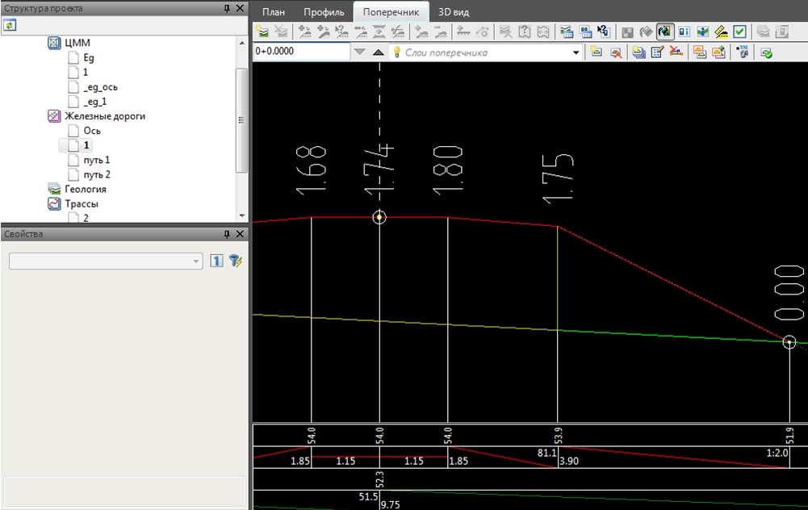
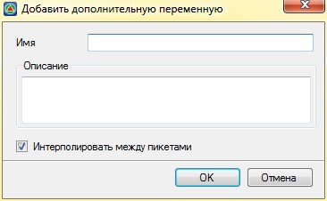
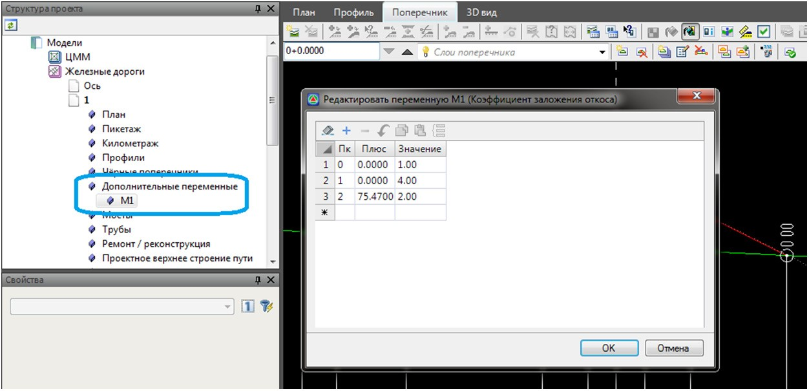
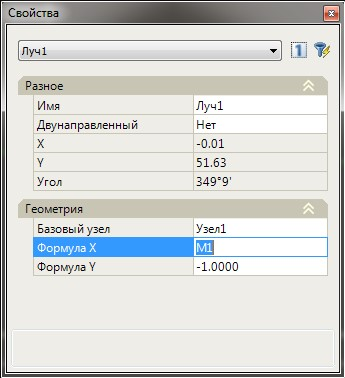

# Пример использования Дополнительных переменных в конструкции поперечника

Ввод дополнительных переменных в пользовательскую конструкцию поперечного профиля позволяет внести дополнительную гибкость и удобство задания параметров данной конструкции на заданном участке трассы.

Дополнительные переменные удобно использовать в случае, когда конструктивному элементу, созданного из узлов, лучей и контуров, на разных пикетажных участках, необходимо задавать различные значения параметров. Т.е., вместо вычисления и задания числового значения параметра конструкции на каждом поперечнике, в соответствующей таблице переменных достаточно лишь задать его значение на начальном и конечном пикетажном участке.



Если значение на начальном и конечном участке будут отличные, то значение переменной на промежуточном пикете (поперечнике) будет найдено интерполяцией.



К примеру, переменными удобно задавать такие параметры как: возвышение наружного рельса второго, третьего и последующих путей; уширение основной площадки второго, третьего и последующих путей; глубину пользовательского водоотводного сооружения, созданного из узлов, лучей и контуров и т.д. Т.е., для любого параметра конструкции, который линейно изменяется на пикетажном участке удобно использовать дополнительные переменные.

Рассмотрим использование дополнительных переменных на примере пользовательской конструкции **Откос**. Для этого:

1. Из узлов, лучей и контуров создадим конструктивный элемент **Откос**. Для этого вставим луч с заложением 1:2, который будет выходить из узла бровки:

   

2. Создадим узел на пересечении луча и линии земли:

   

3. Наводим контур по двум точкам:

   

4. Так как заложение откоса на пикетажном участке может линейно изменяться, то зададим его с помощью переменной. Для этого в **Структуре проекта** раскройте дерево таблиц соответствующей модели дороги и щелкните правой кнопкой мыши на таблице **Дополнительные переменные**. Из появившегося меню выберите пункт **Добавить**, откроется диалоговое окно в котором необходимо задать **Имя** и **Описание переменной**:

   

   Если опция **Интерполировать между пикетами** включена, то значения на промежуточных пикетажных участках будут вычисляться по линейному закону с помощью интерполяции. Если опция выключена, то значение переменной от начала одного до начала следующего пикетажного участка меняться не будет.

5. В окне создания переменной введите необходимые данные и нажмите **ОК**. В структуре проекта появится новая таблица. Двойным щелчком левой кнопки мыши откроем таблицу М1:

   

6. На нужных пикетажных участках задайте значение переменной и нажмите **Ок**.
7. В **Свойствах** выбранного элемента **Луч**, в формулу Х задаем значение «М1» и применяем созданную конструкцию на необходимом пикетажном участке:

   

В результате, вместо переменной «М1» будут присваиваться числовые значения, которые соответствуют заданным числовым значениям в соответствующей таблице **Дополнительные переменные**. Причем, значения переменных, на пикетах поперечников, которые попали на промежуточный участок, будут вычисляться по линейному закону с помощью интерполяции.