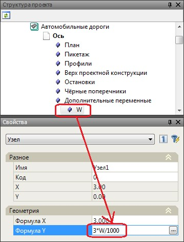

# Использование переменных при создании индивидуальной конструкции поперечного профиля

Под переменными понимаются значения, которые присваиваются элементам конструкции поперечника. Они назначаются из различных таблиц модели. Например, значения переменных могут определяться из таблиц **Верх проектной конструкции** или **Поправки** (для моделей типа **Автомобильные дороги**), из таблиц **Уширения и возвышения** (для моделей типа **Железные дороги**), а также из таблиц **Дополнительные переменные** расположенной в окне **Структура проекта**.

К примеру, переменные могут описывать: ширину, уклон, толщину какого либо конструктивного слоя, параметр уширения земляного полотна и возвышения головки рельса (для моделей типа **Железные дороги**).

Переменные можно использовать как отдельно, так и в составе выражения, описывающего какой либо параметр. Выражения так же могут содержать различные математические функции.

При написании индивидуальной конструкции пользователь может использовать переменные, заданные в текущем подобъекте, или сослаться на переменные заданные в любом другом подобъекте.