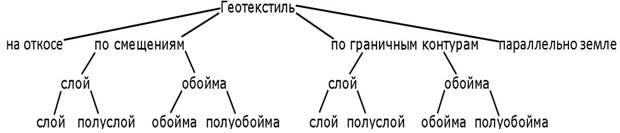

# Геотекстиль

В программе предусмотрено несколько способов укладки геотекстильных конструкций. Их классификация схематично показана ниже:

Весь геотекстиль обязательно имеет следующие характеристики:

## Геотекстиль в откосе

При вставке данного элемента конструкции необходимо указать контур откоса, относительно которого она должна быть уложена. Данный тип геотекстиля задается следующими параметрами:

* 1 - Высота укладки.
* 2 - Смещение при отрисовке.



Дополнительно может быть задан параметр - **Коэффициент увеличения объема**. Это коэффициент, на который будет умножаться геометрический объем данной конструкции.



## Cлой геотекстиля по смещениям границ

При вставке данного элемента конструкции необходимо указать точку привязки на поперечном профиле, относительно которой она должна быть уложена. Данный тип геотекстиля задается следующими параметрами:

* 1 - Высота укладки.
* 2 - Левая граница.
* 3 - Правая граница.



Дополнительно может быть задан параметр - **Коэффициент увеличения объема**. Это коэффициент, на который будет умножаться геометрический объем данной конструкции.



## Слой геотекстиля по граничным контурам

При вставке данного элемента конструкции необходимо указать точку привязки на поперечном профиле, а также граничные контуры слева и справа, относительно которых будет уложена геотекстильная конструкция. Данный тип геотекстиля задается следующими параметрами:

* 1 - Высота укладки.
* 2 - Смещение левой границы.
* 3 - Смещение правой границы.



Дополнительно может быть задан параметр - **Коэффициент увеличения объема**. Это коэффициент, на который будет умножаться геометрический объем данной конструкции.



## Геотекстиль обойма по смещениям границ

При вставке данного элемента конструкции необходимо указать точку привязки на поперечном профиле, относительно которой она должна быть уложена. Данный тип геотекстиля задается следующими параметрами:

* 1 - Высота укладки.
* 2 - Левая граница.
* 3 - Правая граница.
* 4 - Толщина обоймы.
* 5 - Загиб.
* 6 - Уклон границы обоймы.



Дополнительно может быть задан параметр - **Коэффициент увеличения объема**. Это коэффициент, на который будет умножаться геометрический объем данной конструкции.



## Геотекстиль обойма по граничным контурам

При вставке данного элемента конструкции необходимо указать точку привязки на поперечном профиле, а также граничные контуры слева и справа, относительно которых будет уложена геотекстильная конструкция. Данный тип геотекстиля задается следующими параметрами:

* 1 - Высота укладки.
* 2 - Смещение левой границы.
* 3 - Смещение правой границы.
* 4 - Толщина обоймы.
* 5 - Загиб.
* 6 - Уклон границы обоймы.



Дополнительно может быть задан параметр - **Коэффициент увеличения объема**. Это коэффициент, на который будет умножаться геометрический объем данной конструкции.



## Геотекстиль полуслой по смещению границы

При вставке данного элемента конструкции необходимо указать точку привязки на поперечном профиле, относительно которой она должна быть уложена. Данный тип геотекстиля задается следующими параметрами:

* 1 - Высота укладки.
* 2 - Граница.
* 3 - Длина.



Дополнительно может быть задан параметр - **Коэффициент увеличения объема**. Это коэффициент, на который будет умножаться геометрический объем данной конструкции.



## Геотекстиль полуслой по граничному контуру

При вставке данного элемента конструкции необходимо указать точку привязки на поперечном профиле, а также граничный контур, относительно которого будет уложена геотекстильная конструкция. Данный тип геотекстиля задается следующими параметрами:

* 1 - Высота укладки.
* 2 - Граница.
* 3 - Длина.



Дополнительно может быть задан параметр - **Коэффициент увеличения объема**. Это коэффициент, на который будет умножаться геометрический объем данной конструкции.



## Геотекстиль полуобойма по смещению границы

При вставке данного элемента конструкции необходимо указать точку привязки на поперечном профиле, относительно которой она должна быть уложена. Данный тип геотекстиля задается следующими параметрами:

* 1 - Высота укладки.
* 2 - Граница.
* 3 - Длина.
* 4 - Толщина обоймы.
* 5 - Загиб.
* 6 - Уклон границы обоймы.



Дополнительно может быть задан параметр - **Коэффициент увеличения объема**. Это коэффициент, на который будет умножаться геометрический объем данной конструкции.



## Геотекстиль полуобойма по граничному контуру

При вставке данного элемента конструкции необходимо указать точку привязки на поперечном профиле, а также граничный контур, относительно которого будет уложена геотекстильная конструкция. Данный тип геотекстиля задается следующими параметрами:

* 1 - Высота укладки.
* 2 - Граница.
* 3 - Длина.
* 4 - Толщина обоймы.
* 5 - Загиб.
* 6 - Уклон границы обоймы.



Дополнительно может быть задан параметр - **Коэффициент увеличения объема**. Это коэффициент, на который будет умножаться геометрический объем данной конструкции.



## Слой параллельно земле

Данный тип геотекстиля задается следующими параметрами:

* 1 - Высота укладки.
* 2 - Левая граница.
* 3 - Правая граница.



Дополнительно может быть задан параметр - **Коэффициент увеличения объема**. Это коэффициент, на который будет умножаться геометрический объем данной конструкции.

