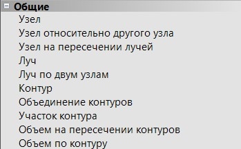
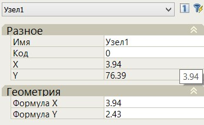
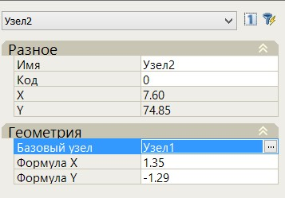
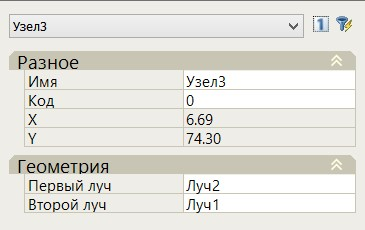
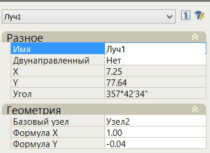
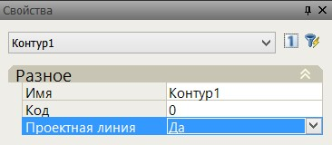
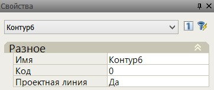
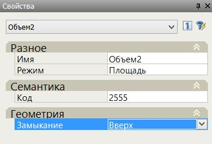
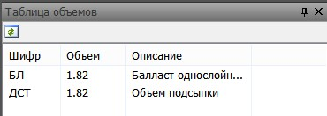
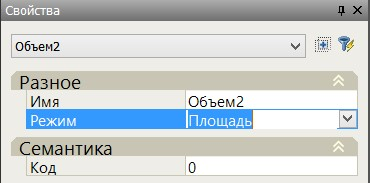

# Индивидуальные элементы

Вкладка **Общие** находящаяся в стандартной палитре предназначена для создания индивидуальных элементов поперечного профиля:

Эти элементы описываются контурами, которые в свою очередь строятся путем соединения узлов. Узлами являются характерные точки поперечного профиля (подошва балласта, бровка основной площадки и т.п.). Предусмотрено несколько различных способов задания положения узловых точек, в том числе, с использованием вспомогательных элементов - лучей.

Созданные индивидуальные элементы могут участвовать в дальнейших построениях, т.е. к примеру, к индивидуальным пользовательским элементам можно в последствии добавлять типовые элементы конструкции. Индивидуальные элементы конструкций также могут быть учтены при подсчете объемов работ вместе с типовыми элементами.

## Создание узлов

Для того чтобы визуально вставить узел в произвольном месте графического поля окна **Поперечник** выберите на вкладке Общие команду **Узел**. Затем, левой кнопки мыши укажите в графическом поле его место вставки.

При выборе места вставки будут динамически отображаться смещение и превышение относительно оси. После указания места вставки узел с автоматически присвоенным ему номером появляется в **Дереве конструкции**. Если выбрать в **Дереве конструкций** или непосредственно в графическом поле предварительно введенный узел, то в окне **Свойства** будут отображены его основные параметры:

**Имя** любого элемента можно изменить. Важно помнить, что оно должно быть уникальным.

В качестве узла привязки можно использовать точки на черном поперечнике, если они закодированы любым кодом кроме 0 (на месте этой точки автоматически создается узел).

**X,Y** - в данных строках отображаются абсолютные отметки и расстояния от оси до узла. Данное поле является информационным и не доступно для редактирования.

**Формула X,Y** - В строках формул могут быть записаны любые числовые значения, выражения, а так же могут быть использованы переменные, например E (возвышение, м), О (уширение, м), для того что бы при изменении возвышения или уширения в соответствующей таблице не пришлось повторно задавать данные значения в свойствах элементов конструкции поперечников.

Расположение осей системы координат поперечного профиля схематично показано ниже:

Где **X,Y** - координаты узла в системе координат поперечного профиля отображаемые в полях X,Y.

**X ось, У ось** - смещение и превышение узла относительно оси, задаваемые в полях Формула X и Формула У.

Значения превышений и смещений, откладываемых против направления координатных осей, т.е. вниз или влево, вводятся с отрицательным знаком.

### Ввод узла относительно другого узла

Данная команда работает аналогично стандартному вводу узла. Однако, положение узла задается не от начала системы координат (оси трассы), а от любого предварительно введенного узла. Для этого:

1. После вызова данной команды, укажите в графическом поле узел, который будет являться базовым.
2. После указания базовой точки, укажите левой кнопкой мыши в графическом поле положение вставляемого узла.

Параметры узла введенного относительно другого можно подкорректировать в стандартном окне **Свойства**:

В поле **Базовый узел** можно изменить точку привязки.

Значения или выражения в полях **Формула X,Y** задаются относительно базового узла.

### Узел на пересечении лучей

Данная команда позволяет привязать узел к точке пересечения двух предварительно созданных лучей. Последовательность действий по созданию и редактированию лучей будет описана ниже.

После вызова данной команды необходимо последовательно указать первый и второй луч. В качестве второго луча может быть использован контур уже предварительно созданной конструкции поперечного профиля или линия черной земли. В результате, в соответствующей точки пересечения лучей или луча и контура будет создан новый узел. Его основные параметры можно отредактировать в стандартном окне **Свойства**:

## Ввод лучей

**Лучи** - это вспомогательные элементы, как правило они используются для определения положения узлов.

Для ввода луча:

1. Выберите команду **Луч** на вкладке **Общие**.
2. Укажите левой кнопкой мыши базовый узел, к которому должен быть привязан луч. Относительно данной точки он будет поворачиваться.
3. Задайте уклон луча. **Уклон** можно назначить визуально, задав направление луча в графическом поле. Для задания точного уклона или его заложения укажите его значение в строке динамического ввода:

При движении курсора в окне динамического ввода автоматически отображается текущее значение уклона. При уклоне меньше 200 промилле - значение уклона отображается в промилле. При уклоне начиная с 1:5 отображается значение заложения. Основные параметры введенного луча можно изменить в стандартном окне **Свойства**.

Для изменения уклона луча измените значения или выражения в полях **Формула X,Y**. В данных полях задается заложение и превышение луча:

### Ввод луча по двум узлам

Данная функция позволяет ввести луч, проходящий через два заданных узла. В данном случае уклон луча при вводе не задается, а всегда рассчитывается программой автоматически на основе положения двух исходных узлов, через которые он проходит. Для ввода луча по двум точкам необходимо последовательно указать первый и второй узел привязки.

## Создание контуров

**Контур** - это линия, которая получается в результате объединения нескольких узлов.

Для того что бы построить контур:

1. Выберите команду **Контур** на вкладке **Общие**.
2. Последовательно укажите на экране узлы, через которые должен пройти создаваемый контур.

Основные параметры созданного контура могут быть изменены в стандартном окне **Свойства**:

Контуру может быть задано любое имя и код.

Если в поле **Проектная линия** выбрать признак **«Да»**, то верхняя часть контура будет отображаться как проектная линия, а в шапке поперечного профиля будут отражены все данные по ней (ширины, уклоны и т.п.). А так же при визуализации проекта данный контур будет отображаться в соответствии с заданным кодом.

### Объединение контуров

Данная команда позволяет объединить два произвольных контура. В результате, создается новый контур на основе двух исходных, если эти контуры не соединены, то они соединяются в ближайших друг к другу точках.

Для этого:

1. Выберите на вкладке **Общие** команду **Объединение контуров**.
2. Последовательно левой кнопкой мыши укажите на экране первый и второй контур.

Параметры вновь созданного контура можно изменить в стандартном окне **Свойства**:

### Создание участка контура

Данная команда создает новый контур из уже существующего контура. После вызова команды необходимо выбрать сначала один узел существующего контура, а потом второй. В результате будет создан новый контур, а эти узлы будут его граничными точками.

Параметры вновь созданного контура также можно изменить в стандартном окне **Свойства**.

### Создание конструкции по границе геологического контура

Функция позволяет создать конструкцию контур по границе геологического слоя. В дальнейшем данный контур может быть использован для подсчета объемов замены грунта.

Для этого:

1. Выберите меню **Поперечник – Утилиты – Создать контур из геологического слоя**, курсор примет форму прицела, укажите геологический слой:

   

2. Укажите **Начальную** и **Конечную** точки контура:

   

3. Выберите участок создаваемого контура:

   

В результате будет построена конструкция **Контур геологии**, которую в дальнейшем, с помощью дополнительных построений можно использовать для подсчета объемов:

### Объем на пересечении контуров

Данная команда создает элемент **Объем**, который считается между двумя исходными контурами. Для создания данного элемента:

1. Выберите на вкладке **Общие** команду **Объем на пересечении контуров**.
2. Последовательно укажите в графическом поле исходные контуры, на основе которых должен быть создан **Объем**.

В результате, в палитре конструкции и на поперечнике появится новый элемент **Объем**.

Параметры вновь созданного элемента можно изменить в стандартном окне **Свойства**:

Данный элемент представляет собой объем типа насыпь/выемка между исходными контурами, при этом параметр **Замыкание** и определяет, что необходимо считать, насыпь или выемку. Если исходные контуры были замкнуты, то объемом будет площадь их пересечения друг с другом. Если контуры не замкнуты, то они будут замкнуты автоматически, причем первый сверху, а второй снизу.

Если наоборот указать сначала верхний, а потом нижний контур то **Объем** не будет создан. В этом случае необходимо пересоздать контур или в свойствах объема изменить тип замыкания на «**Вниз**».

* 1 - **Объем**, который получается, если сначала был выделен плавный контур, а потом ломаный и замыкание «**Вниз**». А также, если сначала был выделен ломаный контур, а потом плавный и замыкание «**Вверх**»
* 2 - **Объем**, который получается если сначала был выделен плавный контур, а потом ломаный и замыкание «**Вверх**». А также, если сначала был выделен ломаный контур, а потом плавный и замыкание «**Вниз**»

В поле **Семантика** можно выбранному контуру задать любой код из **Таблицы шифров и объемов**. Если необходимо присвоить контуру новый код, которого нет в стандартном списке кодов, то данный код необходимо предварительно создать в **Таблице шифров и объемов**.

После того как **Объему** будет присвоен код, данные по нему автоматически появятся в окне **Таблица объемов**:



Если на поперечнике более одного элемента **Объем** с одинаковым кодом, то при подсчете объемов работ значения по ним будут складываться.



### Объем по контуру

Данная функция позволяет создать элемент **Объем** на основе предварительно построенного контура. Для этого:

1. Выберите на вкладке **Общие** команду **Объем по контуру**.
2. Укажите в графическом поле контур, на основе которого должен быть создан **Объем**.

Параметры вновь созданного контура можно изменить в стандартном окне **Свойства**:

В строке **Режим** задается то, что будет считаться: площадь, длина, количество.

### Контур+Объем

Конструкция **Контур+Объем** позволяет единовременно создать две соответствующих конструкции.