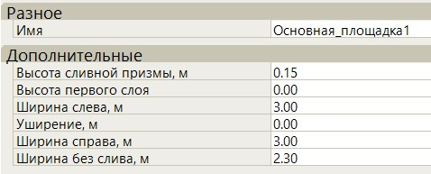
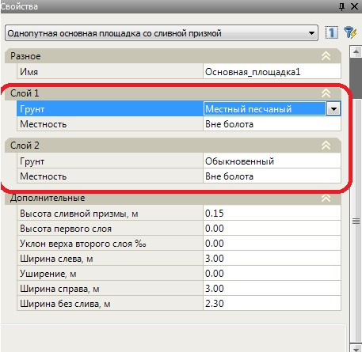

# Основная площадка

**Основная площадка** представляет собой верх земляного полотна, на котором расположен балласт. При вставке данного элемента он привязывается к отметки проектного профиля оси.

**Основная площадка**, как и все остальные элементы, вставляется с параметрами установленными по умолчанию. Далее, через окно **Свойства** выбранного элемента эти параметры могут быть изменены:

Элемент **Основная площадка** может быть нескольких типов, каждый тип задается своим соответствующим набором параметров:



В Палитре элементов имеется возможность выбора двух видов конструкций основных площадок:

1. Основные площадки по БЗП.
2. Основные площадки под ПГР. Отличие данных конструкций состоит только в точке привязки данных конструкций, т.е. к бровке земляного полотна или к проектной головке рельса.

Конструктивно данные виды основных площадок друг от друга не отличаются. 



## Тип 1 (однопутная основная площадка со сливной призмой)

Основные параметры основной площадки данного типа представлены на схеме:

* 1, 2 - Ширина основной площадки слева, справа.
* 3 - Уширение основной площадки слева или справа. Уширение слева задается сотрицательным знаком, а справа с положительным.
* 4 - Высота сливной призмы.
* 5 - Ширина без слива.

Во всех типах основных площадок задается параметр **Высота слоя**. Он используется для конструирования двухслойной насыпи. Если заданы высота верхнего слоя и откосы насыпи, то тело насыпи будет отрисовываться двуслойным:

* 1 - Высота первого слоя.

Также, каждому грунту можно задать свой тип. Данная информация будет впоследствии использована при формировании ведомости земляных работ.

## Тип 2: (основная площадка без сливной призмы)

Основные параметры основной площадки данного типа представлены на схеме:

* 1,2 -Ширина основной площадки слева, справа.
* 3- Уширение основной площадки слева, справа.
* 4 - Разница между проектной и профильной бровкой.
* 5 - Заложение края основной площадки.
* 6 - Высота края основной площадки.
* 7 - Междупутье.



У данного типа основной площадки может быть задано два дополнительных свойства: ось главного пути и ось второго пути. По умолчанию осью главного пути является ось текущего подобъекта. Если задана ось второго пути, то ширина междупутья считается автоматически между этими осями. В другом случае, значение междупутья задается в соответствующем поле стандартного окна **Свойства**. При этом в конструкции поперечника автоматически создается узловая точка по оси второго пути.



## Тип 3: (двухпутная основная площадка со сливной призмой)

Основные параметры основной площадки данного типа представлены на схеме:

* 1,2 - Ширина основной площадки слева, справа.
* 3 - Уширение основной площадки слева, справа.
* 4 - Высота сливной призмы.
* 5 - Междупутье.



 У данного типа основной площадки может быть задано два дополнительных свойства:ось главного пути и ось второго пути. По умолчанию осью главного пути является ось текущего подобъекта. Если задана ось второго пути, то ширина междупутья считается автоматически между этими осями. В другом случае, значение междупутья задается в соответствующем поле стандартного окна **Свойства**. При этом в конструкции поперечника автоматически создается узловая точка по оси второго пути.



## Односкатная основная площадка

1. – Уклон низа.
2. – Высота.
3. – Заложение откоса слева.
4. – Ширина слева.
5. – Уширение.
6. – Заложение откоса справа.
7. – Ширина справа.
8. – Уклон верха.

## Подушка

Основные параметры основной площадки данного типа представлены на схеме:

* 1,2 -Ширина основной площадки слева, справа.
* 3 - Уширение основной площадки слева, справа.
* 4 - Разница между проектной и профильной бровкой.
* 5 - Междупутье.
* 6,7 - Заложение откоса подушки слева, справа.
* 8,9 - Уклон подошвы слева, справа.
* 10 - Высота подушки по оси.



У данного типа основной площадки может быть задано два дополнительных свойства: ось главного пути и ось второго пути. По умолчанию осью главного пути является ось текущего подобъекта. Если задана ось второго пути, то ширина междупутья считается автоматически между этими осями. В другом случае, значение междупутья задается в соответствующем поле стандартного окна **Свойства**. При этом в конструкции поперечника автоматически создается узловая точка по оси второго пути.



## Защитный слой

* 1,2 -Ширина основной площадки слева, справа.
* 3 - Уширение основной площадки слева, справа.
* 4 - Высота сливной призмы.
* 5 - Междупутье.
* 6,7 - Заложение откоса защитного слоя слева, справа.
* 8,9 - Уклон подошвы слева, справа.
* 10 - Толщина защитного слоя по оси.



 У данного типа основной площадки может быть задано два дополнительных свойства: ось главного пути и ось второго пути. По умолчанию осью главного пути является ось текущего подобъекта. Если задана ось второго пути, то ширина междупутья считается автоматически между этими осями. В другом случае, значение междупутья задается в соответствующем поле стандартного окна **Свойства**. При этом в конструкции поперечника автоматически создается узловая точка по оси второго пути.

