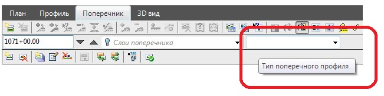

# Наименования типовых поперечных профилей

Данная функция предназначена для назначения уже созданным поперечным профилям определенного номера или названия. В дальнейшем, эта информация будет использована при формировании выходных ведомостей, а также последующего автоматического заполнения соответствующей графы чертежа продольного профиля.

Для задания наименования типового поперечного профиля используется выпадающий список в окне **Поперечник**:

Раскрыв выпадающий список имеется возможность текущему или выбранной группе поперечников назначить необходимый типовой поперечник или выбрать тип **Другой** и далее в открывшемся окне ввести имя нового типового поперечника.