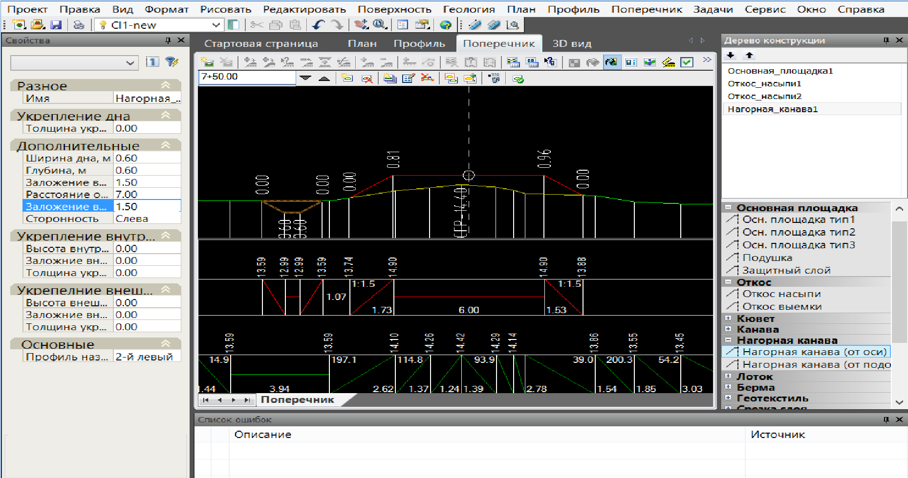
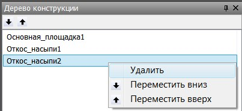
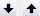
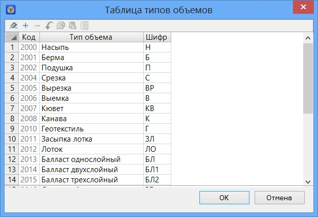

# Палитра элементов конструкций

В **Robur** реализован особый метод формирования конструкции поперечников из набора стандартных конструктивных элементов. Данные элементы находятся в специальной палитре конструкций.

Для того что бы вызвать палитру конструкций выберите элемент меню **Поперечник - Показать палитру элементов конструкций**. Для того что бы потом увидеть добавленные элементы выберите **Поперечник - Показать дерево элементов конструкций**.

В данном окне приведен список всех стандартных элементов. Программа поддерживает специальную библиотеку настраиваемых стандартных элементов. Каждому элементу соответствует ряд основных параметров, которые позволяют однозначно запроектировать конструкцию поперечного профиля.

Все элементы сгруппированы по типам и при нажатии левой кнопкой мыши на значки «**+/-**» можно скрывать-раскрывать соответствующий список.

Для того что бы добавить элемент в поперечный профиль, щелкните левой кнопкой мыши по его наименованию в окне **Палитра конструкций**, после этого он автоматически появится в графическом поле окна **Поперечник**, а также в окне Дерево конструкций. В данном окне показан весь набор элементов, которые содержит текущий поперечный профиль, для его открытия воспользуйтесь элементом меню **Поперечник - Показать дерево элементов конструкций**.

Если вставка объекта неоднозначна, то на поперечном профиле появляются специальные кружки, таким образом выделяются места, куда можно прикрепить выбранный элемент. После выбора точки привязки элемент поперечного профиля пристраивается к конструкции с установленными по умолчанию у него параметрами, они отображаются в окне **Свойства** и доступны для редактирования. В этом окне также можно изменить имя элемента и его точку привязки.

Таким образом, конструкция проектного поперечного профиля представляет собой древовидную структуру, в которой к одним элементам прицепляются другие, и так далее.

Если из **Дерева конструкций** удалить элемент, к которому прикреплены какие-либо другие элементы, то они все удаляются тоже. Предварительно программа предупреждает об этом и выводит их список.

Для удаления элемента конструкции воспользуйтесь одним из следующих способов:

* Щелкните правой кнопкой мыши по его наименованию в окне Дерево конструкций и выберите из появившегося контекстного меню пункт **Удалить**.

  

* Выберите левой кнопкой мыши соответствующий элемент в окне **Дерево конструкций** и нажмите клавишу **Delite**.

Как уже было сказано ранее, в данном списке важна последовательность расположения элементов. Т.к. это влияет на саму логику их конструирования. К примеру, различные элементы поправок к объемам модифицирующие основные слои дорожной одежды должны располагаться после (ниже по списку) данных слоев. При необходимости изменения положения элемента в списке выделите его и воспользуйтесь кнопками .



Перемещать элемент по списку можно с помощью мыши, удерживая конструкцию левой кнопкой мыши.



Выбирать элементы конструкции для редактирования можно не только через вышеуказанное окно, но и визуально, непосредственно в графическом поле окна **Поперечник**. Для этого щелкните по соответствующему элементу левой кнопкой мыши. Если под выбираемым элементом расположены другие, к примеру, контуры объемов, то появится дополнительное контекстное меню со списком. Выберите из появившегося списка, элемент который необходимо отредактировать или удалить и выполните требуемое действие.

Если помимо основной палитры конструкций было дополнительно открыто окно Объемов, то в нем будут отображаться три колонки: **Шифры, Объемы** и **Описание** контуров текущего поперечного профиля. Объемы не замкнутых контуров считаются в метрах, а замкнутых - в квадратных метрах. При изменении параметров поперечного профиля значения объемов пересчитываются автоматически. Для открытия окна объемов воспользуйтесь элементом меню **Поперечник - Показать окно объемов.**

Для просмотра или редактирования полного списка всех шифров и объемов с описанием воспользуйтесь элементом меню **Поперечник - Таблица шифров и объемов**. Откроется следующее окно:

К существующему списку стандартных кодов можно добавлять пользовательские коды. Добавляемые в таблицу новые строки по умолчанию содержат данные с не зарезервированными кодами, в последствие, эти коды могут быть применены при создании индивидуальных пользовательских элементов конструкций. Последовательность действий по созданию индивидуальных элементов будет описана ниже в разделе: [Создание индивидуальных конструкций](individual_elements.md).

Элементы конструкций в палитре сгруппированы по типам. Описание основных конструктивных элементов и их параметров представлено ниже.