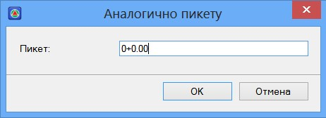

# Проектирование аналогичных поперечников аналогично заданному пикету

Иногда возникает ситуация, когда необходимо создать поперечник аналогично уже запроектированному, на каком-либо пикете. Для этого выберите элемент меню **Поперечник - Утилиты - Копировать конструкцию с пикета**, появится следующее окно:

Укажите пикет поперечного профиля, конструкцию которого необходимо применить на текущем поперечнике и нажмите **ОК**.



Функция **Копировать конструкцию с пикета** работает и для группы выбранных поперечников, для этого необходимо предварительно выбрать пикетажный участок (группу поперечников), на котором должны быть запроектированы поперечники аналогично заданному пикету.

