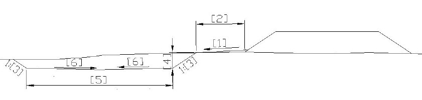

# Резерв

При вставке данного элемента необходимо указать откос, к которому должен быть пристроен **Резерв**. Для элемента конструкции **Резерв** задаются следующие параметрами:

* 1 – Уклон бермы.
* 2 – Расстояние до подошвы.
* 3 – Заложение внешнего и внутреннего откосов резерва.
* 4 – Глубина по внутренней подошве резерва.
* 5 – Ширина дна резерва.
* 6 – Уклон дна резерва (может быть как односкатный или двускатный).



При задания резерва с бермой, ее уклон должен быть больше фактического уклона местности.

