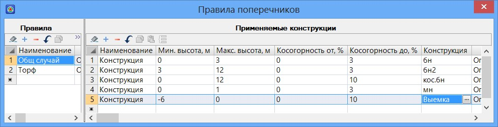
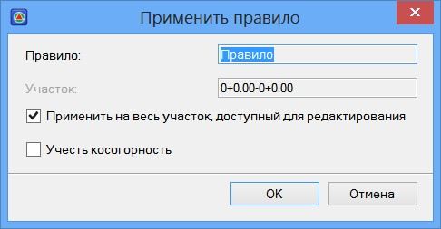

# Правила

С помощью правил можно осуществлять автоматическое конструирование поперечных профилей на заданных участках, в зависимости от их высотных отметок, косогорности рельефа и т.п. Для того чтобы создать правило выберите элемент меню **Поперечник - Правило поперечников**. Откроется следующая таблица:

С помощью данной таблицы можно создать правила, согласно которому, автоматически будет определяться какой тип поперечного профиля земляного полотна необходимо использовать на заданном пикете.

Для того чтобы создать новое правило нажмите кнопку **+**, добавив этим строку в поле **Правило**. На трассе может быть применено несколько различных правил, каждое на своем участке. В поле Правило создается набор используемых правил. Столбцы **Наименование** и **Описание** правил являются информационными и необязательными для заполнения.

Параметры текущего правила отражаются в поле **Применяемые конструкции**. Диапазон применения каждой типовой конструкции описывается в данном поле отдельной строкой.

Для того чтобы задать описание текущего правила добавьте с помощью кнопки **+** в поле **Применяемые конструкции** несколько строк. Их количество должно соответствовать числу типовых конструкций применяемых в правиле.

Столбцы **Наименование** и **Описание** являются информационными и не обязательными для заполнения.

В полях столбца **Конструкция** выбирается предварительно созданный файл типовой конструкции, который должен быть применен в текущем диапазоне высот и косогорности. Последовательность действий по созданию файлов типовых поперечников будет описана [ниже](save_and_load.md).

В полях **Минимальная высота** и **Максимальная высота** задается диапазон высот, на котором будет применяться назначенная конструкция. К примеру, если в данной строке значение минимальной высоты задано 0м., а максимальная высота равна 2м., то текущая конструкция будет применена на тех участках, где рабочие отметки более 0 м., но менее 2м. При задании отрицательных значений минимальной и максимальной высоты подразумевается создание выемки. Так, к примеру, если необходимо применить правило для выемок глубиной от 2 до 4 метров, то необходимо задать следующие параметры: **Минимальная высота** - «-4», **Максимальная высота** - «-2».

Косогорность считается по следующей схеме:

В поле **Конструкции** должны быть занесены типовые конструкции. Они обязательно должны храниться текущем проекте, в папке **Конструкции поперечника**.

После задания всех параметров правила или группы правил, применим его/их на соответствующих участках трассы. Для этого выделите в поле **Правило** наименования тех правил которые необходимо применить и нажмите кнопку **Применить правило**. Появится следующие диалоговое окно:

По умолчанию выбранные правила применяются на всю трассу. Если же его необходимо применить на определенном участке, то для этого снимите опцию **Применить на весь участок** и задайте в поле **Участок** его пикетажные значения. Для применения правила нажмите кнопку **ОК**.

В результате, программа осуществит привязку типовых поперечных профилей на выбранном участке согласно заданным правилам.