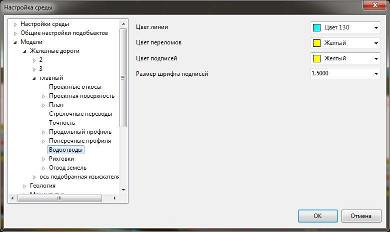
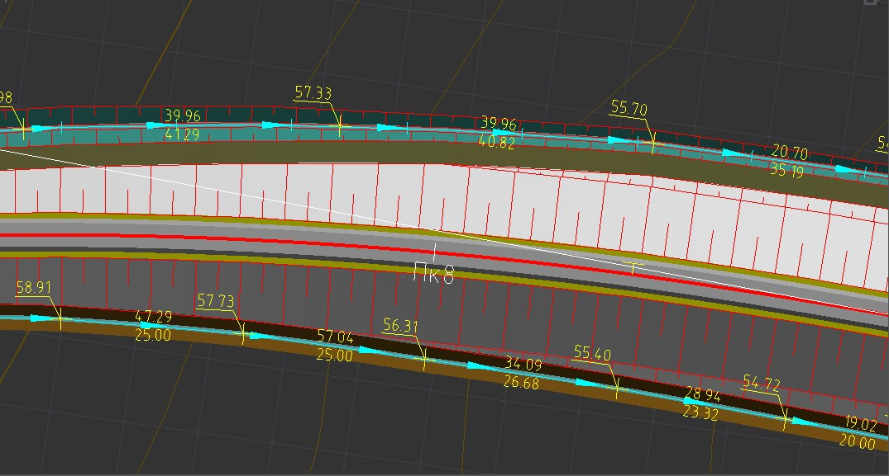

# Настройки отображения водоотводов

Запроектированный водоотвод отображается в окне **План**, для настройки его отображения:

1. В окне **Структура проекта** щелкните правой кнопкой мыши по наименованию текущей модели **Железная дорога** и выберите из появившегося контекстного меню пункт **Настройки**.

2. Раскройте дерево настроек и выберите вкладку **Водоотводы**:

   

   

   В данном окне задаются настройки текущей модели подобъекта Железные дороги. Для задания настроек по умолчанию для вновь создаваемых моделей, а также общих настроек проекта, воспользуйтесь элементом меню **Сервис - Настройки**.

   

3. Задайте необходимые настройки и нажмите **Ок**.

В результате водоотводы будут отрисованы на плане в соответствии с заданными настройками.

