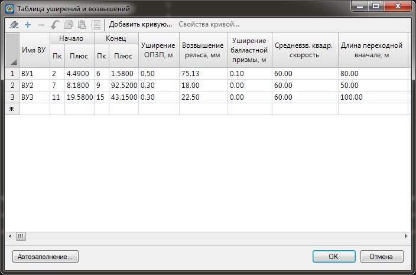
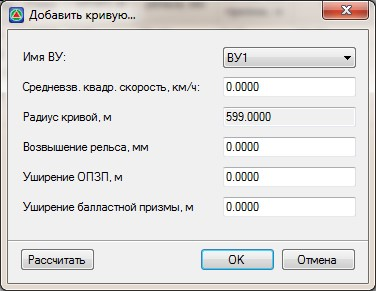

# Уширения и возвышения

С целью нейтрализации вредного влияния центробежной силы на путь и на пассажиров наружная рельсовая нить приподнимается (возвышается) над внутренней. Из-за этого возникает уширение земляного полотна. В меню **Поперечник - Таблица уширений и возвышений** задаются все необходимые параметры:

Для расчета уширений и возвышений на заданной кривой нажмите кнопку **Добавить кривую**. Появится отдельное диалоговое окно:

В поле **Имя ВУ** из выпадающего списка выберите одну из вершин углов поворота трассы, для которой необходимо произвести расчет. После выбора вершины автоматически будет заполнено информационное поле **Радиус кривой,м**. Укажите в соответствующем поле значение среднеквадратической средневзвешенной по тоннажу скорости и нажмите кнопку **Рассчитать**.

Рассчитанные данные по кривой будут добавлены в таблицу уширений и возвышений.

* Возвышение рельса считается по следующей формуле:

$h = 12,5·K(υ²ср/R),$

где:

* $υ²ср$ - среднеквадратическая средневзвешенная по тоннажу скорость.
* $R$ - радиус кривой.
* $К$ - коэффициент принимаемый по следующему правилу:

если $υ²ср < 140 км/ч. то К=1$

если $υ²ср ≤ 140 км/ч. то К=1,2$

* Величина уширения(м) основной площадки земляного полотна принимается по следующему правилу:

При

| $R ≥ 3000$ | $У = 0,2$ |
| --- | --- |
| $1800 ≤ R < 3000$ | $У = 0,3$ |
| $700 ≤ R < 1800$ | $У = 0,4$ |
| $R < 700$ | $У = 0,5$ |

* Величина уширения балластной призмы принимается всегда равной 0,1 м при $R < 600$ м

С помощью команды **Свойства** кривой посмотреть, изменить и пересчитать какую либо строку таблицы. Для того что бы автоматически рассчитать значения уширений и возвышений по всей трассе нажмите кнопку **Автозаполнение**. При необходимости автоматически заполненные программой значения уширений и возвышений , могут быть отредактированы в данной таблице. В дальнейшем данные этой таблицы будут использованы при конструировании поперечных профилей.

Т.е., после того как будет заполнена таблица, с неё автоматически будут браться параметры уширения и возвышения для земляного полотна и балласта. Причем, если в свойства основной площадки и балласта значения возвышения и уширения равны нулю, то это означает, что эти параметры определяются из **Таблицы уширений и возвышений**. Если в свойствах элемента конструкции вместо нуля поставить любое другое значение, то **Таблица уширений и возвышений** будет проигнорированна, и для построения поперечников будут использованы введенные вручную значения.