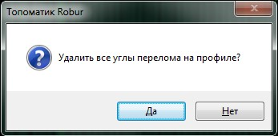

# Очистка профиля

Опция предназначена для удаления всех вершин на продольном профиле.

Для того, чтобы удалить все вершины с продольного профиля выберите элемент меню **Профиль - Очистить профиль**. Программа запросит подтверждение:

Для удаления всех вершин с продольного профиля нажмите **Да**.