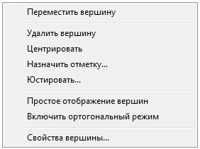
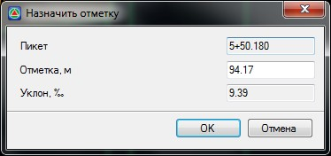
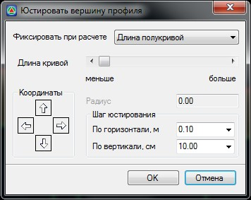
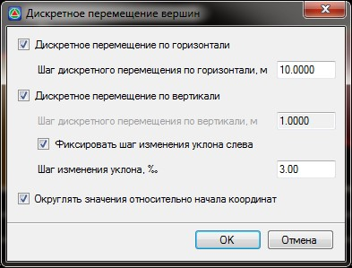
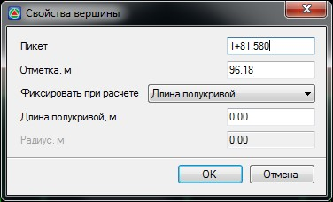

# Контекстное меню редактора продольного профиля

При щелчке правой кнопкой мыши по вершине, появляется контекстное меню:

Выберите пункт **Переместить вершину** для перехода в режим визуального перемещения данной вершины.

Для удаления выберите пункт **Удалить вершину**.

**Центрировать** - центрирует вершину относительно соседних вершин. Данная функция используется при проектировании продольного профиля без прямых участков, из кривой в кривую. При выборе этой функции программа рассчитывает положение вершины и длину вертикальной кривой таким образом, чтобы кривая на данной вершине примыкала к кривым на соседних вершинах без образования прямых вставок.

Опция **Назначить отметку** позволяет задать проектную отметку вершины. При выборе этой функции открывается диалоговое окно, в котором можно задать ее пикет и отметку:

**Юстировать** - функция предназначена для точной корректировки профиля. При выборе этой функции открывается окно:

При помощи элементов данного окна находящихся в поле **Координаты** можно перемещать вершину в ортогональных направлениях с заданным шагом юстирования.

При юстировке вершины имеется возможность фиксировать при расчете либо длину полукривой, либо радиус кривой, выбирая необходимое условие из соответствующего выпадающего списка. В зависимости от выбранного элемента будет доступно либо задание длины кривой, либо значение радиуса в соответствующем поле ввода.

**Простое\Расширенное отображение вершин** - скрывает\показывает дополнительные элементы визуального редактирования продольного профиля, в частности ручки (грипы) перемещения вдоль тангенсов.

Функция **Дискретное перемещение** позволяет перемещать вершины с заданным шагом. Выбрав данную, опцию откроется диалоговое окно:

* **Дискретное перемещение по горизонтали** - включение\отключение режима дискретного перемещения вершины по горизонтали. **Шаг перемещения** задается в соответствующем поле ввода.
* **Дискретное перемещение по вертикали** - включение\отключение режима дискретного перемещения вершины по вертикали. **Шаг перемещения** задается в соответствующем поле ввода.
* **Фиксировать шаг изменения уклона слева** - данный режим позволяет перемещать вершину таким образом, чтобы элемент профиля слева от перемещаемой вершины всегда имел значение уклона кратное шагу, задаваемому в поле **Шаг изменения уклона**.
* **Округлять значения относительно начала координат** - при выборе данной опции, заданный шаг дискретного перемещения по вертикали/ горизонтали и изменения уклона при перемещении вершины профиля, будет отсчитываться от округленных значений относительно начала координат, т.е. значения параметров элементов профиля (уклон, расстояние) и вершины (отметка) будут всегда кратны заданным значениям дискретного перемещения. При отключенной опции, дискретные перемещения будут осуществляться относительно текущих параметров элементов профиля и вершины.

**Включить ортогональный режим** - включение данной опции позволяет перемещать вершину только в ортогональных направлениях.

**Свойства вершины** - функция позволяет изменить **Пикет, Отметку, Длину полукривой** или **Радиус**. При выборе пункта меню **Свойства вершины** откроется диалоговое окно:

