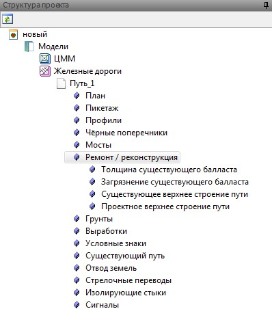
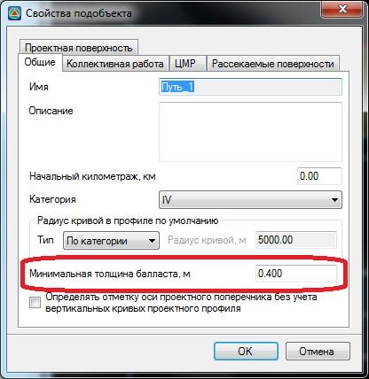
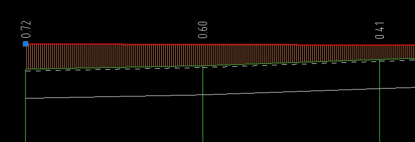

# Создание профиля по РГР (расчетной головке рельса)

Функция используется при проектировании ремонта или реконструкции железнодорожных путей и предназначена для автоматического создания первого приближения проектного продольного профиля по линии расчетной головке рельса (РГР).

Для отображения линии РГР в окне профиль:

Разверните в окне **Структура проекта** дерево таблиц текущего подобъекта. В группе таблиц **Ремонт\реконструкция** заполните данные по существующему\проектному верхнему строению пути (ВСП), толщине существующего балласта и т.д:



Минимальная толщина проектного балласта задается в **Свойствах** текущего подобъекта:



Данные заполненные в таблицах **Ремонт\реконструкция** отображаются на продольном профиле в виде сплошной линии - линия низа существующего балласта и пунктирной линии - **РГР**.



Видимость данных линий на продольном профиле можно отключить с помощью окна настроек текущего подобъекта (см. ниже п. [Настройка продольного профиля](setup_profile.md)).



После того когда заданы необходимые исходные данные по верхнему строению существующего и проектируемого пути, по линии РГР можно сформировать первое приближение проектного профиля. Для этого, выберите элемент меню **Профиль - Проектировать по РГР**.

В результате, программа по данным линии расчетной головки рельса (РГР) создаст первое приближение профиля по проектной головки рельса (ПГР).