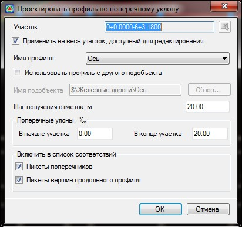
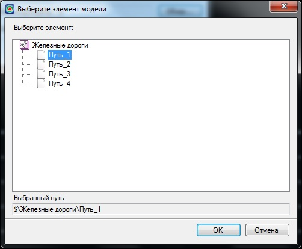

# Проектировать профиль по поперечному уклону

Функция предназначена для проектирования профиля таким образом, чтобы в поперечном отношении между текущим и выбранным исходным профилем был соблюден заданный поперечный уклон.

Для этого:

1. Выберите меню **Профиль - Проектировать профиль по поперечному уклону**, откроется диалоговое окно:

   

**Применить на весь участок, доступный для редактирования** - по умолчанию профиль создается на всю трассу, при отключении данной опции появится возможность задать участок проектирования. Участок можно задать непосредственно в поле ввода или указать графически при помощи соответствующей кнопки.

**Имя профиля** - из выпадающего списка выбирается исходный профиль, используемый для построения текущего.

**Использовать профиль с другого подобъекта** - с помощью данной функции имеется возможность задать в качестве исходного профиля, профиль с другой модели. Для этого выберите кнопку **Обзор**, откроется диалоговое окно:

В открывшемся окне выберите необходимую модель подобъекта, профиль которой необходимо использовать в качестве ссылки, нажмите **ОК**.

**Шаг получения отметок** - опция, позволяющая при проектировании профиля по перечному уклону учесть дополнительные отметки ссылочного профиля, шаг получения которых задается в соответствующем поле ввода.

**Поперечные уклоны** – значение величины поперечного уклонов (в промилле) в начале и конце выбранного участка. Если уклон в начале не равен уклону в конце, то на промежуточных точках участка уклоны будут интерполироваться по линейному закону.

**Включить в список точек соответствий** – задает дополнительные характерные точки, которые будут созданы на профиле. В этих точках будет соблюдаться точное соответствие заданного поперечного уклона.