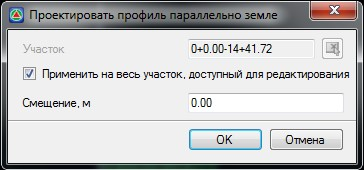

# Проектирование профиля параллельно земле

Функция предназначена для проектирования проектного профиля параллельно линии черного профиля с заданным вертикальным смещением:

Для этого:

1. Выберите элемент меню **Профиль – Проектировать параллельно земле**, откроется диалоговое окно:

   

   **Применить на весь участок, доступный для редактирования** - по умолчанию профиль строится на всю трассу, при отключении данной опции появится возможность задать участок проектирования. Участок можно задать непосредственно в поле ввода или указать графически при помощи соответствующей кнопки.

   **Смещение, м** - в данном поле ввода задается вертикальное смещение линии проектного профиля относительно линии черного профиля.

2. Задайте необходимые настройки формирования проектного профиля и нажмите **ОК**.