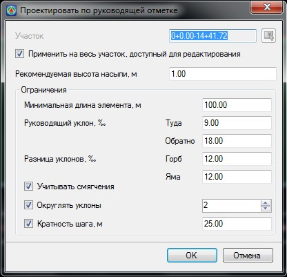

# Проектирование профиля по руководящей отметке

Опция позволяет автоматически запроектировать участок продольного профиля по критерию минимального отклонения от руководящей отметки.

Чтобы автоматически запроектировать участок продольного профиля по руководящей отметке:

1. Выберите элемент меню **Профиль – Проектировать по руководящей отметке**, откроется диалоговое окно:

   

     * **Применить на весь участок, доступный для редактирования** - по умолчанию профиль создается на всю трассу, при отключении данной опции появится возможность задать участок проектирования. Участок можно задать непосредственно в поле ввода или указать графически при помощи соответствующей кнопки.
     * **Рекомендуемая высота насыпи** - в данном поле задается значение руководящей отметки на участке проектирования.
     * **Минимальная длина элемента** - в данном поле задается минимальная длина элемента между вершинами профиля.
     * **Руководящий уклон (Туда\Обратно)** - значения максимальных продольных уклонов для прямого и обратного направления.
     * **Разница уклонов** - значение максимальной разницы уклонов смежных элементов продольного профиля.
     * **Учитывать смягчения** - включение данной опции позволяет контролировать попадание элемента профиля на круговую кривую в плане. В данном случае уклон элемента профиля уменьшается на величину смягчения, которое равно 700/R.
     * **Округлять уклоны** - устанавливается необходимое количество знаков после запятой, до которого необходимо произвести округление уклонов.
     * **Кратность шага, м** - при включении данной опции длина элемента продольного профиля (расстояния между ВУ) всегда будет кратна заданному шагу.
2. Установите необходимые настройки и нажмите **ОК**.

В результате программа автоматически создаст первое приближение продольного профиля.