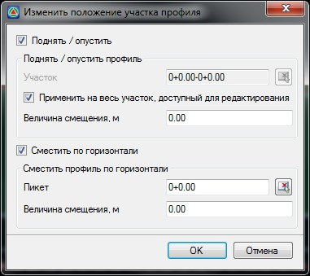

# Поднятие, опускание и смещение профиля

Функция предназначена для того чтобы поднять, опустить или сместить все отметки точек проектного профиля на заданную величину.

Для этого:

1. Выберите меню **Профиль - Поднять, опустить или сместить профиль**, откроется диалоговое окно:

   

   **Поднять\Опустить** - включите данный режим, если отметки продольного профиля необходимо поднять или опустить на заданную величину.

   **Применить на весь участок, доступный для редактирования** - по умолчанию редактируется весь участок профиля. При отключении данной опции появится возможность задать участок проектирования. **Участок** можно задать непосредственно в поле ввода или указать графически при помощи соответствующей кнопки.

   **Величина смещения, м** - задается величина вертикального смещения отметок профиля. Положительная величина смещения поднимет точки на заданную величину , а отрицательная величина опустит.

   **Сместить по горизонтали** - включите данный режим, если участок продольного профиля необходимо сместить по горизонтали на заданную величину.

   **Пикет** - задается пикет начала участка смещения. Его можно выбрать визуально на продольном профиле, нажав соответствующую кнопку.

   **Величина смещения, м** - задается величина горизонтального смещения линии профиля. Положительная величина смещения сместит профиль относительно начальной точки вправо, а отрицательная величина влево.

2. Установите необходимые настройки смещения профиля и нажмите **ОК**.