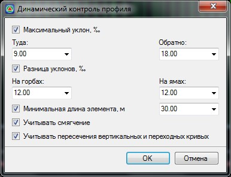

# Настройка контроля профиля

Функция предназначена для проверки элементов профиля на отклонение их фактических величин от нормативных показателей.

Для настройки контролируемых параметров:

1. Выберите меню **Профиль - Настройка контроля профиля**, откроется диалоговое окно:

   

   **Максимальный уклон** - включите данный режим для контроля значений максимальных продольных уклонов. Значения максимальных уклонов выберите из соответствующих выпадающих списков или введите собственные значения.

   **Разница уклонов** - включите данный режим для контроля разницы уклонов смежных элементов. Значения максимальной разницы уклонов на «**Горбах**» и на «**Ямах**» выберите из соответствующих выпадающих списков или введите собственные значения.

   **Минимальная длина элемента, м** - включите данный режим для контроля величины минимально допустимого расстояния между переломами профиля. Минимальное его значение выберите из соответствующего выпадающего списка или введите собственное значение.

   **Учитывать смягчения** - включение данной опции позволяет контролировать максимально допустимый уклон элемента с учетом величины смягчения (которое равно 700/R).

   **Учитывать пересечения вертикальных и переходных кривых** - включение данной опции позволяет контролировать наличия зон, на которых переходных кривые в плане совпадают с вертикальными кривыми в продольном профиле.

2. Установите опции напротив тех параметров, которые необходимо контролировать и нажмите **ОК**.

В результате, в случае отклонения параметров каких-либо элементов продольного профиля от нормативных, программа выдаст предупреждения пометив их соответствующими значками расположенными над шапкой профиля.