# Настройка продольного профиля

Для настройки стиля отображения продольного профиля текущего подобъекта, а также включения\отключения видимости различных элементов на продольном профиле:

1. В **Структуре проекта** нажмите правой кнопкой мыши на наименовании текущего подобъекта и выберите из появившегося контекстного меню пункт **Настройки**:

   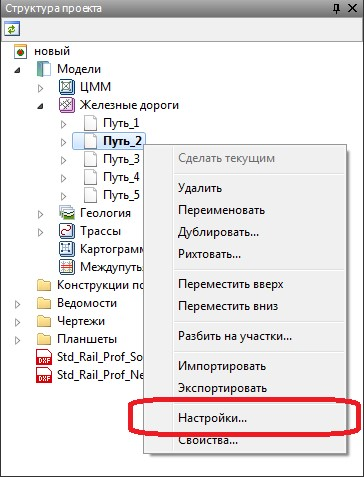

2. В данном окне откройте вкладку **Продольный профиль**:

   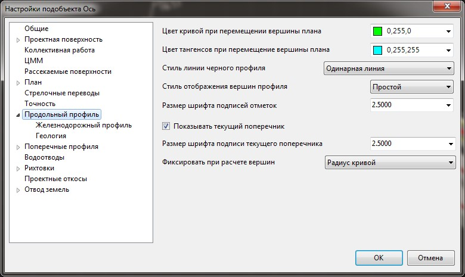



В данном окне задаются настройки текущей модели подобъекта **Железные дороги**. Для задания настроек по умолчанию для вновь создаваемых моделей, а также общих настроек проекта, воспользуйтесь элементом меню **Сервис - Настройки**.



Из выпадающего списка **Стили линии** выберите необходимый вариант отображения линии черного профиля:

#|
||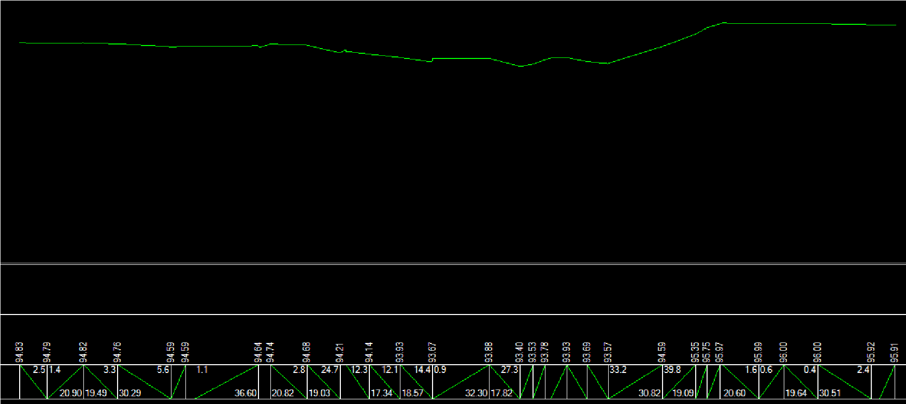|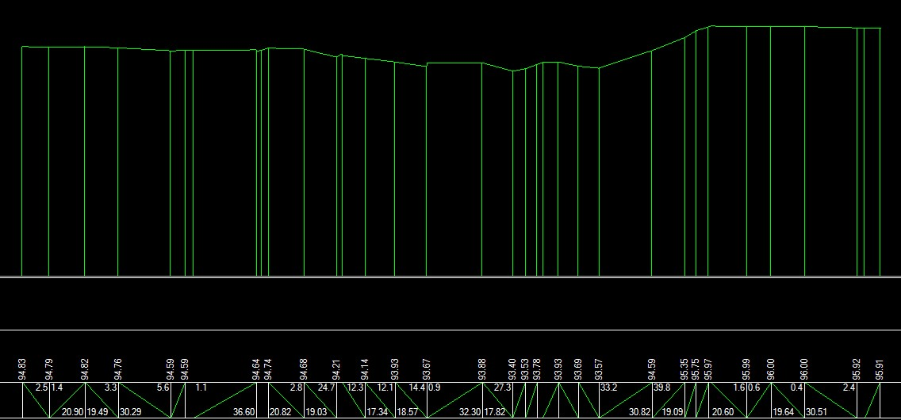|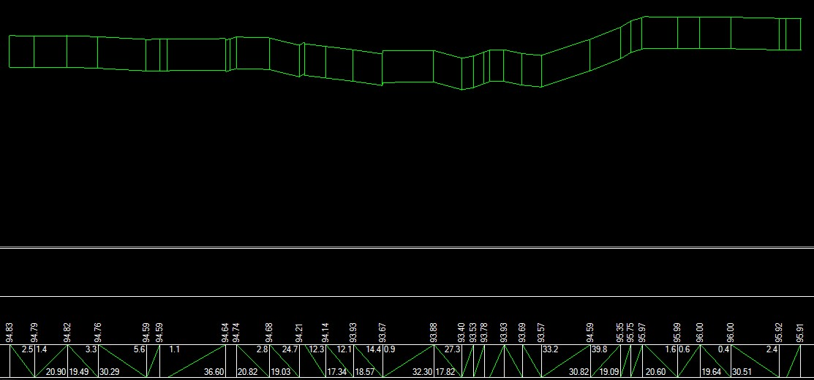||
|| Одинарная линия |Одинарная линия с подвалом|Двойная линия||
|#

Данная настройка влияет на отображение линии черного профиля как в рабочем окне **Профиль**, так и на его выходных чертежах.

## Стиль отображения вершин профиля:

**Простой режим отображения** - в данном режиме, в виде ручек (грипов) отображаются только вершины переломов продольного профиля:

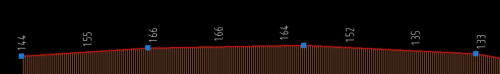

**Расширенный режим** - в данном режиме отображаются дополнительные ручки (грипы) предназначенные для редактирования продольного профиля:

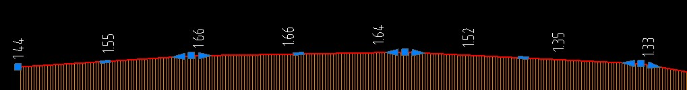

**Размер шрифта подписи отметок** - в данном поле ввода задается размер шрифта подписей отметок на продольном профиле.

**Показать текущий поперечник** - при включении данной опции, на продольном профиле отображается пикет текущего поперечника:

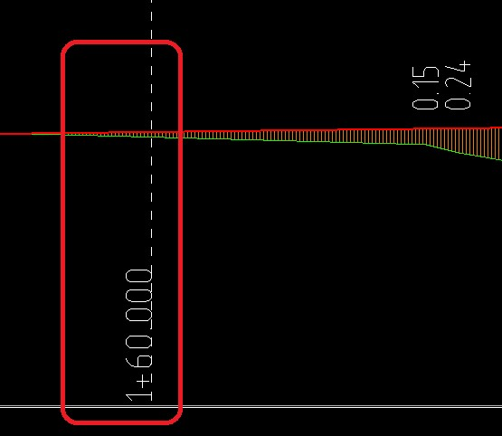



Для настройки размера шрифта подписи текущего поперечника используйте соответствующее поле ввода.



**Фиксировать при расчете вершин** - из выпадающего списка выбирается параметр по умолчанию, который будет использоваться для всех вновь создаваемых вершин при редактировании продольного профиля.

Выше были описаны настройки продольного профиля, которые являются общими для групп моделей **Железная дорог** а и **Автомобильная дорога**. Часть дополнительных специальных настроек также расположены на вкладке **Железнодорожный профиль**:

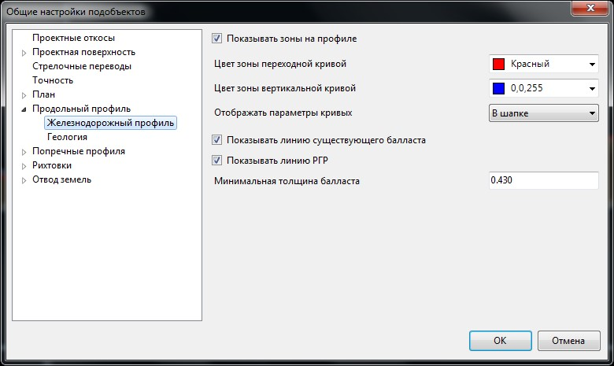

**Показывать зоны на продольном профиле** - включение данной опции позволяет отобразить на продольном профиле зоны переходной кривой и вертикальной кривой, а также контролировать их наложение:

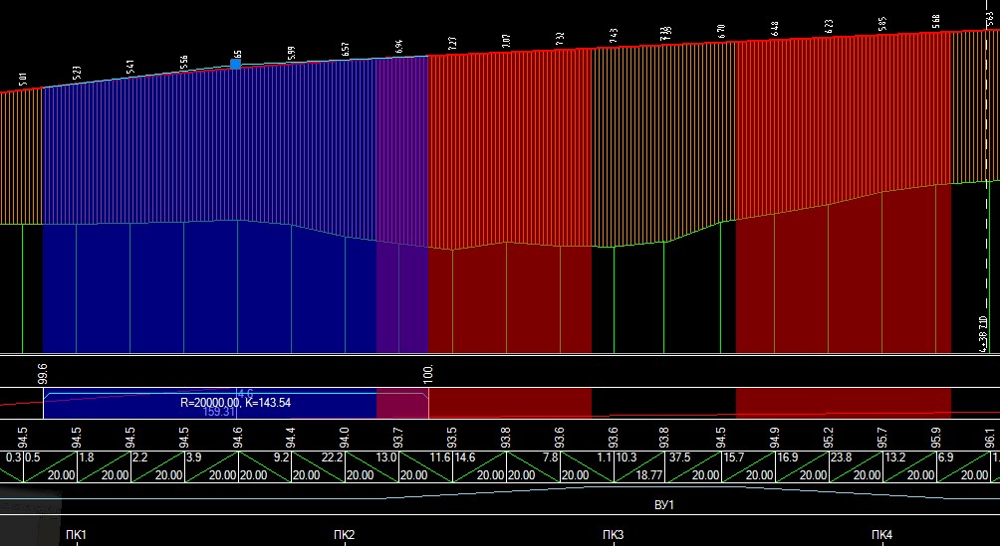



Цвет зон задается в соответствующих выпадающих списках.



Отображать параметры кривых - в данном выпадающем списке выберите необходимый вариант отображения параметров вертикальных кривых на продольном профиле:

* **В шапке** - вертикальные кривые рисуются на продольном профиле, а их параметры подписываются в шапке чертежа:

  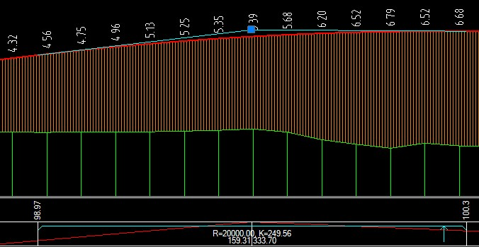

* **Над шапкой** - параметры вертикальных кривых подписываются над шапкой чертежа указанным образом:

  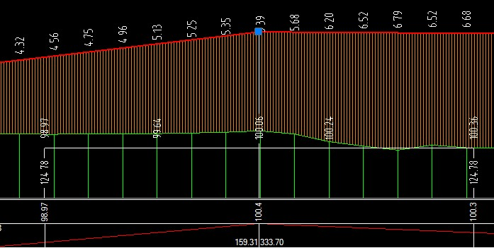

**Не отображать** - вертикальные кривые не отображаются на продольном профиле, а в шапке не подписываются их параметры:

  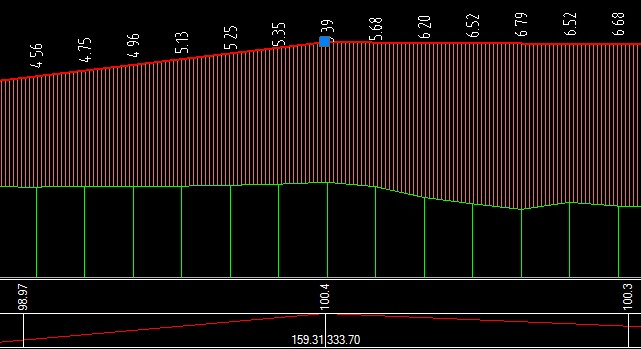

**Показывать линию существующего балласта, Показывать линию РГР** - данная настройка предназначена для включения\отключения видимости данных линий на продольном профиле.