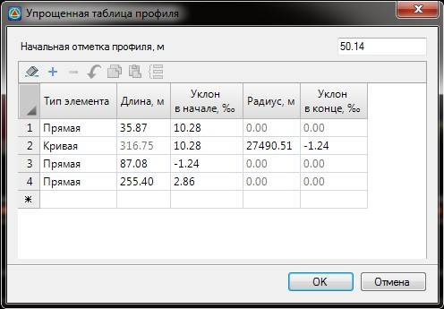

# Упрощенный профиль

Данная функция позволяет создавать проектный профиль последовательным заданием параметров его элементов в табличном виде.

Для этого:

1. Выберите меню **Профиль - Упрощенный профиль**, откроется диалоговое окно: 

   

   **Начальная отметка профиля** - поле ввода для задания значения отметки первого элемента профиля.

   **Тип элементов** - из выпадающего списка выбирается соответствующий тип элемента (Прямая или Кривая).

   Каждый элемент задается своими параметрами, например при выборе элемента **Прямая** станут доступными поля ввода **Длина** и **Уклон в начале**. Тип элемента **Кривая** определяется **Уклоном в начале**, **Радиусом** и **Уклоном в конце**.

2. Задайте необходимые данные и нажмите **Ок**. В результате программа по заданным табличным параметрам построит линию проектного продольного профиля.