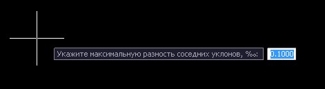

# Сгладить участок профиля

Функция позволяет автоматически удалить вершины проектного профиля на участках где разница уклонов между соседними элементами меньше заданной.

Для этого:

1. Выберите меню **Профиль –Утилиты– Сгладить участок профиля**, в строке **Динамического ввода** укажите максимальную разность уклонов между смежными элементами и нажмите **Enter**:

   

2. Секущей рамкой выберите участок профиля.

В результате, на выбранном участке, программа удалит необходимые вершины продольного профиля.