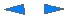
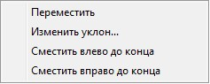
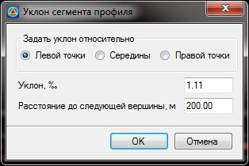
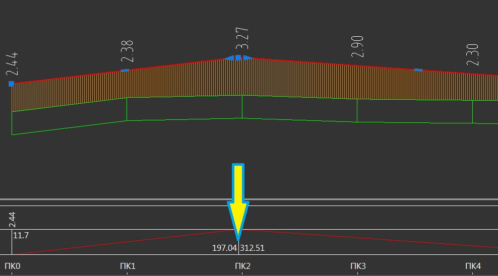
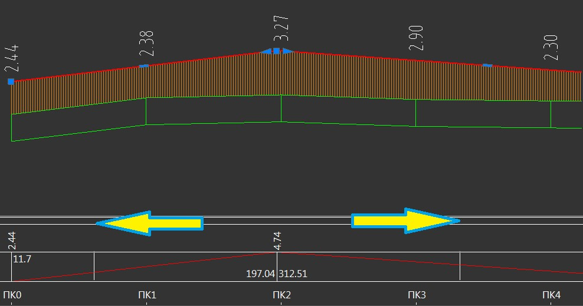
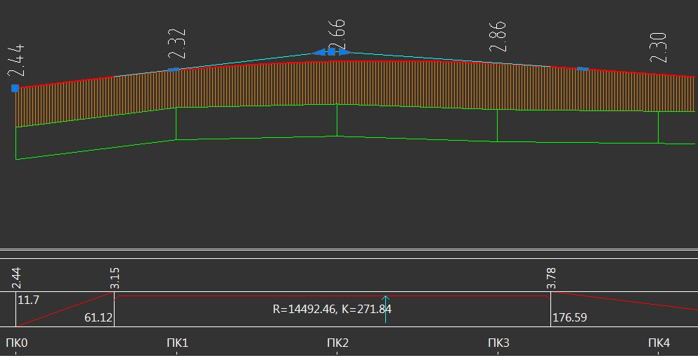

# Визуальное проектирование продольного профиля

Данный способ проектирования продольного профиля при помощи мыши, позволяет быстро запроектировать первое приближение проектной линии. Для этого на продольном профиле имеются специальные фиксированные ручки (грипы) синего цвета:

 - Используется для перемещения вершины перелома продольного профиля.

 - Используются для перемещения вершины перелома продольного профиля вдоль правого и левого тангенса.

При нажатии правой кнопки мыши на данной ручке (грипе) откроется контекстное меню:

* Выберите опцию **Переместить вершину по тангенсу** для того чтобы перейти в режим перемещения вершины вдоль тангенса.
* Опция **Сместить к вершине** позволяет автоматически сместить вершину вертикальной кривой в сторону смежной кривой. Данный функционал удобен для проектирования профиля «без прямых вставок».
* Опция **Сместить на величину** позволяет сместить вершину по пикетажу или против на заданное расстояние.

  

  Данные ручки (грипы) отображаются только при включении расширенного режима отображения вершин продольного профиля (см. ниже п. [Настройка продольного профиля](setup_profile.md)).

  

 - Данный грип (ручка) находится на середине прямолинейного элемента продольного профиля и предназначена для параллельного его перемещения.



 Данные ручки (грипы) отображаются только при включении Расширенного режима отображения вершин продольного профиля (см. ниже п. [Настройка продольного профиля](setup_profile.md)).



При нажатии правой кнопки мыши на данной ручке (грипе) откроется контекстное меню:

* Выберите опцию **Переместить** для перехода в режим параллельного перемещения данного элемента продольного профиля.
* При выборе опции **Изменить уклон**, откроется диалоговое окно:

  

  Выберите точку относительно которой будет назначаться уклон (левая точка, правая точка или середина элемента) и задайте значение **Уклона** в соответствующем поле ввода.

  В поле **Расстояние до следующей вершины** имеется возможность задать расстояние до следующей вершины по ходу пикетажа.

* **Сместить влево\вправо до конца** позволяют прямо-параллельно переместить прямолинейный элемент профиля на максимально возможное расстояние влево или вправо.

Имеется возможность визуально вписать вертикальную кривую в перелом продольного профиля, для этого:

1. Наведите курсор мыши на границу двух смежных прямых элементов профиля в нижней части окна и зажмите левую кнопку мыши:

   

2. Не отпуская левой кнопки мыши перетащите границу кривой вправо или влево:

   

3. Отпустите левую кнопку мыши, программа впишет вертикальную кривую:

   