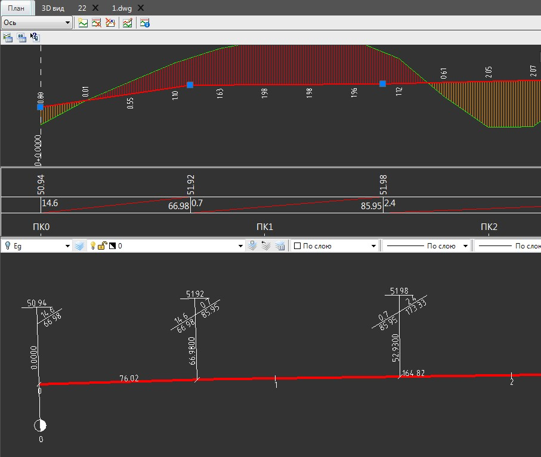
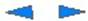
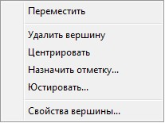
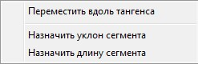

# Работа с уклоноуказателями

**Уклоноуказатель** - это элемент вертикальной планировки, который автоматически отображается на плане в местах перелома продольного профиля, т.е. в местах изменения продольного уклона, на них отображается информация по параметрам смежных элементов продольного профиля (уклон, длина, отметка).

Для создания дополнительного уклоноуказателя в окне **План**, щелкните дважды левой кнопкой мыши в области оси трассы, с одновременно зажатой клавишей **Alt**. При этом, автоматически, в месте вставки уклоноуказателя на плане, добавится и перелом (дополнительная вершина) на продольном профиле.

Элемент **Уклоноуказатель напрямую** связан с переломами (вершинами) продольного профиля, что позволяет отображать данные по элементам профиля и редактировать их окне **План**.

Для редактирования уклоноуказателя:

Выделите элемент **Уклоноуказатель**, появятся ручки (грипы), которые работают аналогично ручкам (грипам) на продольном профиле:

 Используется для перемещения вершины перелома продольного профиля влево или вправо сохраняя отметку.

 Используются для перемещения вершины перелома продольного профиля вдоль правого и левого тангенса.

При нажатии правой кнопки мыши на ручку (грип) , откроется контекстное меню:

При нажатии правой кнопки мыши на одну из ручек (грипов)  , откроется контекстное меню:



Данный функционал аналогичен функционалу работы с ручками (грипами) в продольном профиле, которые были уже подробно описаны в настоящей главе (см раздел [Контекстное меню редактора продольного профиля](context_menu.md)).

