# Основные этапы

Основные этапы проектирования вторых путей включают в себя:

1. Подбор параметров кривых на существующем пути.
2. Задание контрольных междупутий с учетом подобранных параметров существующего пути.
3. Проектирование планового положения второго пути с учетом контрольных междупутий.
4. Увязка пикетажа существующего пути и второго пути.
5. Выправка существующего пути относительно проектируемого второго пути. В случае если проектом предусмотрена реконструкция существующего пути.
6. Создание продольного профиля по второму пути.
7. Создание продольного профиля по отрихтованному пути. В том случае если проектом предусмотрена реконструкция существующего пути и продольные профиля второго пути и отрихтованного пути будут отличаться.
8. Создание поперечных профилей в подобъекте существующего пути.
9. Формирование основных ведомостей и чертежей.



Данные этапы проектирования обусловлены последовательностью производства работ, когда по достроенному второму пути необходимо перепустить движение поездов и после этого реконструировать существующий путь.



Далее подробно рассмотрим каждый из перечисленных этапов.

## Подбор параметров кривых существующего пути

Для определения параметров кривых предусмотрено специальное окно График кривизны.



Функционал по подбору кривых существующего пути был подробно рассмотрен ранее ([СмРабота с трассой, Выправка пути](../../rail_tasks/straightening_way/selection_path.md)).



Подобранный путь используется в дальнейшем для назначения контрольных междупутий, формирования соответствующих чертежей, а также для принятия решения о необходимости реконструкции существующего пути.

## Задание контрольных междупутий

Контрольные междупутья задаются в подобъекте существующего пути. Для задания величин междупутий используется параметры кривых подобранного пути и мосты, заданные в соответствующей таблице окна **Структура проекта**.

Данные по заданным контрольным междупутьям также хранятся в структуре проекта, в таблице **Контрольные междупутья**:

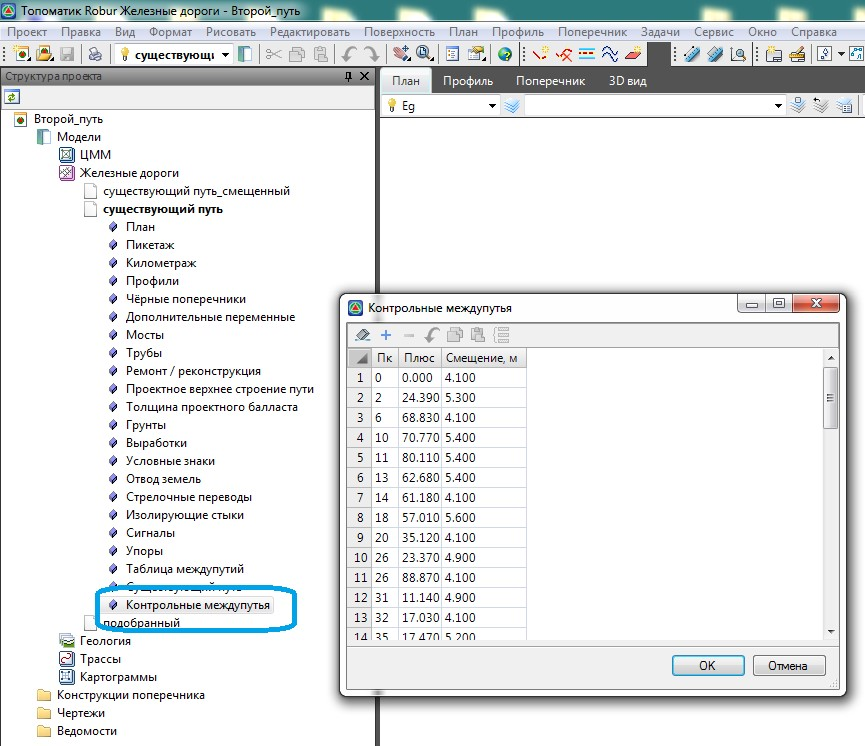

Для удобного и наглядного задания контрольных междупутий в программе реализовано специальное окно.

Для его открытия выберите элемент меню **Задачи – Вторые пути – График контрольных междупутий**.



При первом запуске этой функции необходимо визуально на плане указать подобранный путь, который будет соответствовать существующему пути. Программа сохранит выбранный подобъект в Настройках подобъекта и при следующем вызове данной функции подобранный путь запрашиваться не будет:

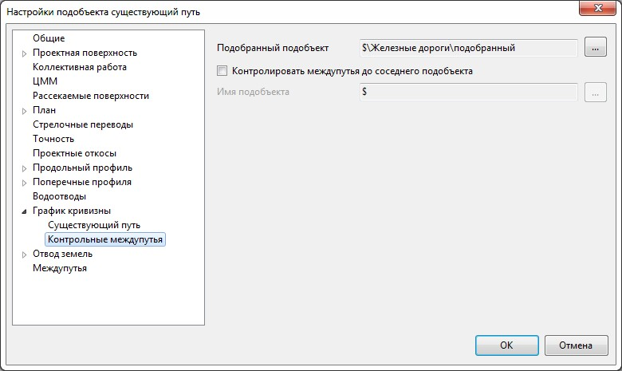



После этого откроется окно График контрольных междупутий:

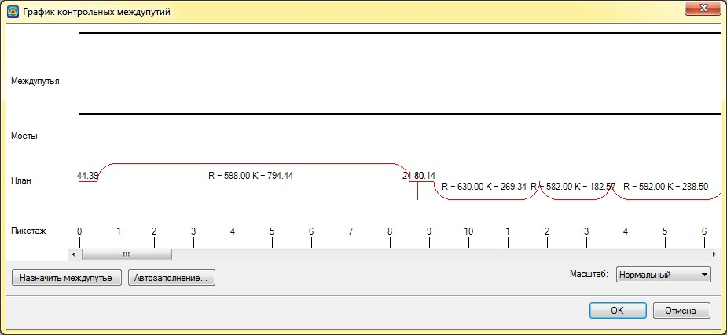

В открывшемся окне отображаются следующие данные: график контрольных междупутий, мосты заданные в соответствующей таблице в **Структуре проекта** для существующего пути, план линии подобранного пути и пикетаж.

В правой части окна находится настройка **Масштаб**. Задавая разный масштаб можно изменять отображение данных в окне.

В левой части окна находится кнопка **Назначить междупутье**. С ее помощью можно назначить междупутье на участке или на всей трассе.

Для автоматического расчета контрольных междупутий нажмите кнопку **Автозаполнение**, откроется диалоговое окно:

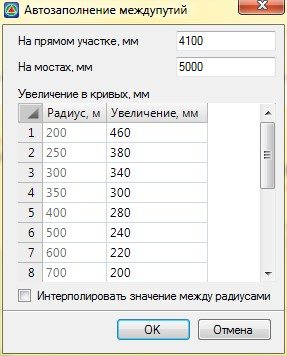

В соответствующих полях ввода задайте контрольные междупутья на мостах и прямых участках.

В поле **Увеличение в кривых** задается значения увеличений контрольных междупутий в зависимости от радиуса поворота. Увеличения для каждого значения радиуса могут быть отредактированы.

При включении опции **Интерполировать значения между радиусами**, увеличения на промежуточных значениях радиусов будут вычисляться по законам линейной интерполяции, если опция выключена, то увеличение на всем интервале между смежными радиусами будет одинаковое и принято по меньшему радиусу.

Механизмы ручного назначения контрольных расстояний в окне **График контрольных междупутий**:

1. С помощью кнопки **Назначить междупутье** зададим общее междупутье (междупутье на прямой) для всей трассы. По умолчанию в поле **Начало** и **Конец участка** уже стоят пикеты начала и конца трассы:

   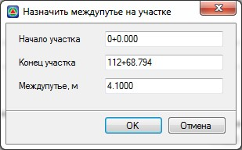

2. Далее зададим междупутья на кривых. При наведении курсора на любой элемент (кривую или прямую) в поле **План**, программа выделяет этот элемент пунктирной линией:

   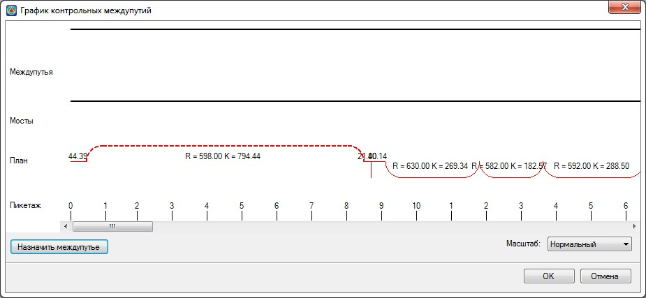

   При выборе выделенного элемента левой кнопкой мыши открывается окно **Назначить междупутье на участке**:

   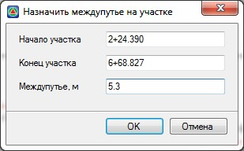

   В поле **Начало** и **Конец** участка программой автоматически будут установлены значения границ прямой – если выбиралась прямая или границ чистой круговой кривой (без переходных кривых) – если выбиралась кривая. Далее необходимо задать величину **Междупутья** для выбранного участка.

   Программа графически начинает отображать заданное на данном участке междупутье на графике междупутий:

   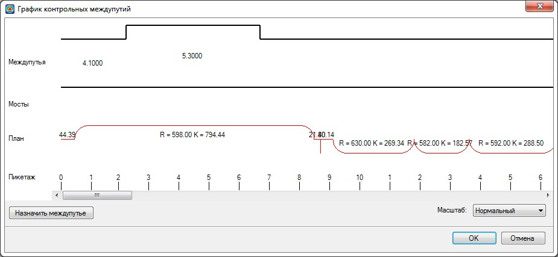

   Аналогично назначаются междупутья для кривых, где это необходимо.

3. Зададим междупутье на мостах. Междупутья на мостах задаются аналогично междупутьям на кривых. При наведении курсором на мост он выделяется пунктирной линией:

   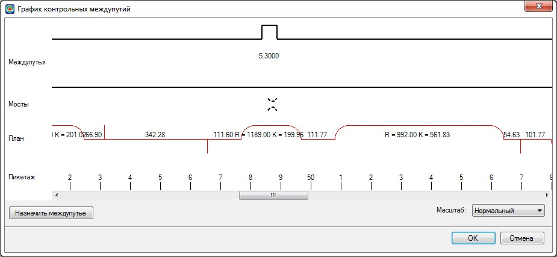

   При выборе моста открывается окно **Назначить междупутье на участке**. В поле **Начало** и **Конец участка** программа автоматически установит пикетажные границы моста. Пользователь при необходимости может скорректировать пикетажные границы участка и задать величину междупутья на мосту:

   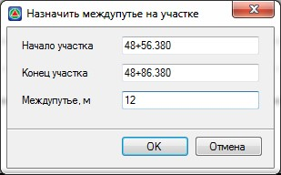

   После задания междупутья на мосту эти изменения тут же отобразятся на графике междупутий:

   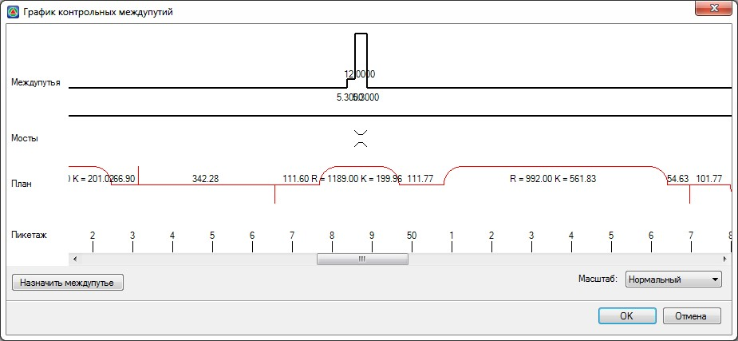

4. Зададим междупутья на других неучтенных участках. Для этого, выберите кнопку **Назначить междупутье**, в открывшемся окне аналогичным образом задайте начало и конец участка, а также величину междупутья.

## Проектирование планового положения второго пути

Плановое положение второго пути может проектироваться различными способами.

К примеру, одни его участки могут проектироваться в окне **План**, а другие с использованием окна график кривизны. Рассмотрим вариант проектирования с использованием окна **График кривизны**.

Для начала получим первое приближение плана второго пути. Сместим для этого предварительно созданный подобъект второго пути на величину основного междупутья (междупутья на прямой) относительно подобранного пути. Таким образом, на прямолинейных участках междупутье будет выдержано. Для этого:

Выберите элемент меню **Задачи – Вторые пути – Сместить план на заданное расстояние**.

Укажите подобъект подобранного пути, величину смещения и сторону смещения.

Программа удалит текущую ось, если она была предварительно создана и имела какие-то геометрические построения и заменит ее смещенной.



Если общий состав работ предполагает рихтовку существующего пути и последовательность работ такова, что сначала будет рихтоваться существующий путь, а затем к нему пристраиваться второй путь. То при использовании функции **Сместить план на заданное расстояние** в качестве исходного подобъекта нужно указать не подобранный, а отрихтованный путь.



Теперь заполним таблицу междупутий, которая находится на панели **Структура проекта**. Междупутья отобразятся на плане, так же междупутья будут отображаться в окне поперечник:

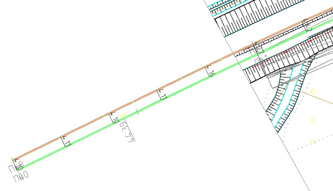

Так как основные этапы проектирования (продольный профиль и поперечники) выполняются в подобъекте существующего пути **Таблицу междупутий** в **Структуре проекта** необходимо заполнить для существующего пути:

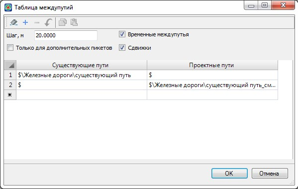

Если проект предусматривает рихтовку существующего пути, то для существующего пути (на данном рисунке это первая строка) в столбце **Проектные пути** необходимо указать отрихтованный путь.



Правило назначения междупутных расстояний было подробно описано ранее. [СмЖелезная дорога, Задачи](../intertrack_space/create_intertrack_space.md).



Теперь для того чтобы наглядно видеть на плане и в окне **График кривизны** требуемые величины междупутий, для проектируемого второго пути, заполним таблицу существующий путь.

Для этого: убедитесь что второй путь является текущим, далее выберите элемент меню **Задачи - Вторые пути - Заполнить существующий путь по контрольным междупутьям**. Укажите подобъект существующего пути и сторону смещения.

В результате программа для подобъекта второго пути заполнит таблицу **Существующий путь** в **Структуре проекта**, данными подобъекта существующего пути, смещенными на величину контрольных междупутий. Это делается для того, что бы в дальнейшем можно было воспользоваться окном **График кривизны**, для подбора положения подобъекта второго пути.

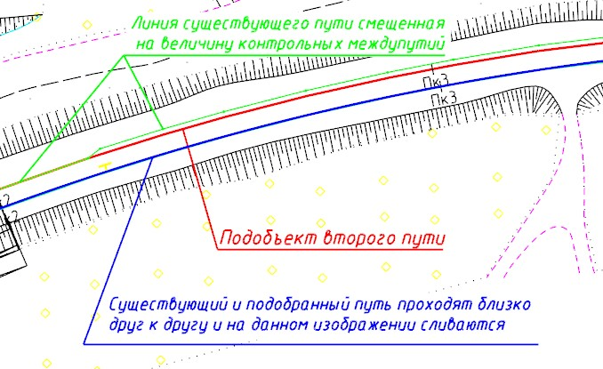

**На третьем этапе** займемся подбором плана второго пути. Так как все данные динамически пересчитываются во всех окнах программы, подбирать путь можно либо на графике кривизны, либо на плане или совмещать эти два способа.

Для подбора второго пути с помощью графика кривизны выберите элемент меню **Задачи – Вторые пути – Показать окно**. На отдельной вкладке откроется окно **Рихтовки**:

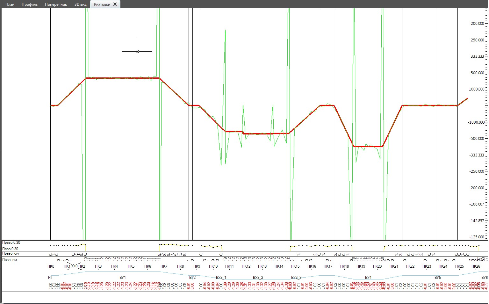



Так как данная команда используется для подбора планового положения второго пути, то текущей должен быть именно подобъект второго пути.



На графике кривизны красной линий отображается план второго пути, зеленой линией отображается существующий план смещенный на величину контрольных междупутий.

В шапке окна **Рихтовки** отображаются расчетные данные. Часть из них не используются в подборе плана второго пути – эти данные можно отключить, часть из них используется – эти данные необходимо включить (если их видимость не включена).

Для того что бы настроить отображение данных в окне **Рихтовки** нажмите правую клавишу в поле таблиц с данными внизу окна и выберите пункт **Свойство панели**.

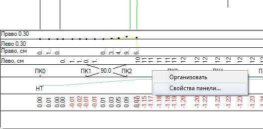

В окне **Свойство сетки профиля** пользователь может управлять видимостью данных, которые программа будет отображать на экране.

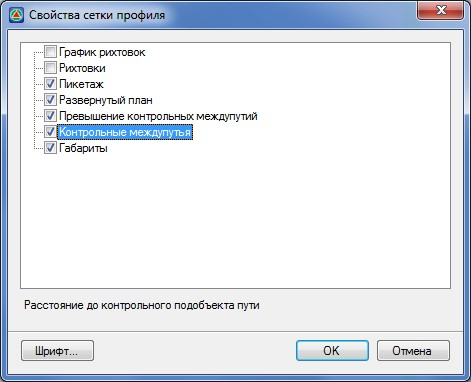

Для подбора оси второго пути потребуются панели **Контрольные междупутья** и **Превышение контрольных междупутий**.

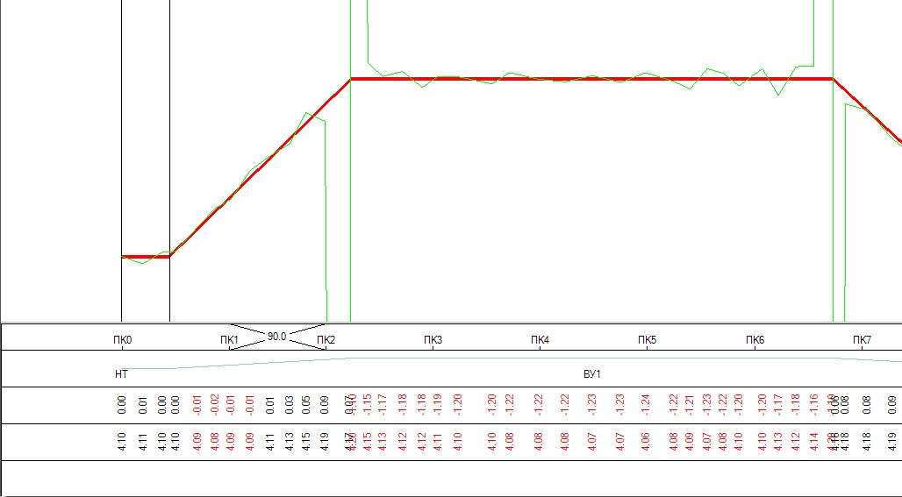

В строке **Контрольные междупутья** – отображаются текущие междупутные расстояния. Если текущее междупутье на каком-то пикете меньше контрольного, оно будет подсвечиваться красным цветом.

В строке **Превышение контрольных междупутий** – отображаются значения, указывающие на сколько текущее междупутье больше или меньше контрольного междупутья. Если текущее междупутье на каком-то пикете меньше контрольного, то значение будет отрицательным и программа выделит его красным цветом.

Идеальный вариант проектирования - когда значение **Превышение контрольных междупутий** является положительным числом близким к нулю.

Используя функционал данного окна, может осуществляться окончательный подбор положения второго пути.



Подробно функционал окна **Рихтовки** описан в соответствующем разделе. [См.Работа с трассой, Выправка пути](../straightening_way/selection_path.md).



Все изменения сделанные в окне **Рихтовка** будут динамически отображаться в окне **План**. Пользователь может совмещать подбор оси на графике кривизны и в окне **План**. Например, прямой участок, проходящий по искусственному сооружению, будет удобнее указать в окне **План**, а подобрать параметры кривой на подходах к искусственному сооружению, с учетом контрольных междупутий, удобнее будет сделать на графике кривизны.

## Увязка пикетажа

На следующем этапе необходимо увязать пикетаж по второму пути с пикетажем по существующему пути. Расхождение пикетажа возникает в основном на кривых. Увязку пикетажа, как правило, делают на целом пикете, на прямом участке за кривой. Если идут несколько кривых подряд пользователь может принять решения и увязать пикетаж после конца второй кривой.

Для этого в программе предусмотрена специальная функция, которая работает в полуавтоматическом режиме – пользователь сам указывает пикеты, на которых необходимо увязать пикетаж и вставить резаные пикеты.

Для того что бы увязать пикетаж выберите элемент меню **Задачи – Вторые пути – Указать резаные пикеты**. Программа попросит указать подобъект **Главного пути** (Существующего пути) с которым нужно увязывать пикетаж. Засечки пикетов на указанном пути подсветятся красным цветом:

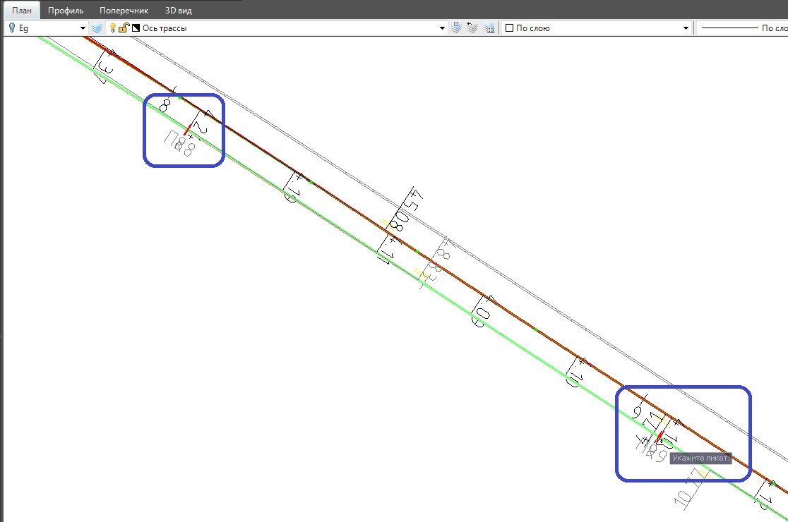

Далее последовательно указываются пикеты, на которых программа добавит резаные пикеты:

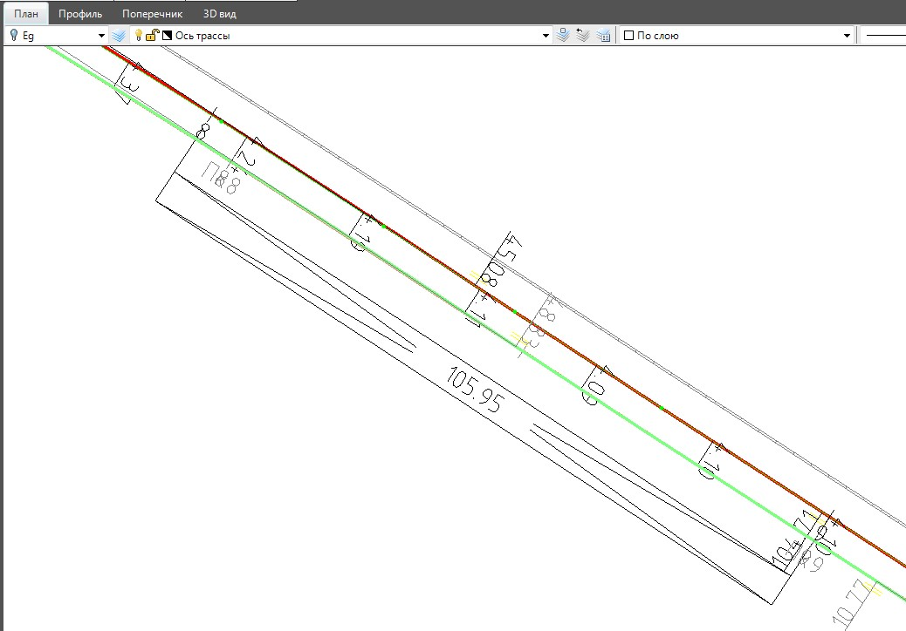

Данные по рубленым пикетам хранятся в структуре проекта, в таблице **Пикетаж**.

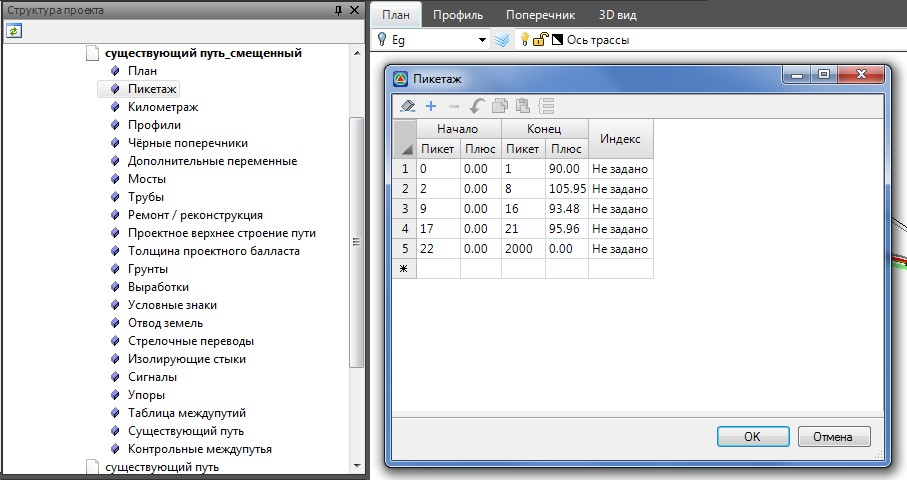

## Выправка существующего пути относительно запроектированного второго пути

Данный этап нужен в том случае, если проектом предусмотрена реконструкция существующего пути.

Выправка существующего пути также как правило, происходит на графике кривизны.



Данный функционал подробно описан в соответствующем разделе.[См. Работа с трассой, Выправка пути](../straightening_way/selection_path.md).



Если в процессе выправки существующего пути в окне **Рихтовки** необходимо видеть междупутье до второго пути, установите соответствующую опцию в настройках подобъекта:

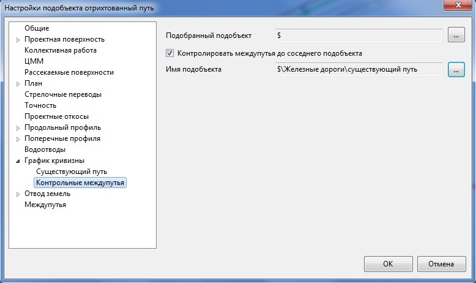

## Создание продольного профиля по второму пути

Продольный профиль по второму пути делается в подобъекте существующего пути. Исходными данными является существующая головка рельса. Проектировать продольный профиль можно любым доступным способом, главное, что бы в профиле было как можно больше подсыпок и как можно меньше подрезок.



Функционал по проектированию продольного профиля был подробно описан ранее в соответствующем разделе. См. [Железные дороги, Проектирование продольного профиля](../../rail_profile/projecting_longitudinal_profile.md).



## Создание продольного профиля по отрихтованному пути

Данный этап нужен в том случае, если проектом предусмотрена реконструкция существующего пути. И отрихтованный путь будет целиком или на отдельных участках иметь свой продольный профиль.

Продольный профиль по отрихтованному пути проектируется в подобъекте отрихтованного пути. Исходными данными является профиль по существующей головке рельса, который необходимо скопировать с существующего пути на отрихтованный путь. Это можно сделать путем экспорта/импорта соответствующих таблиц в структуре проекта.

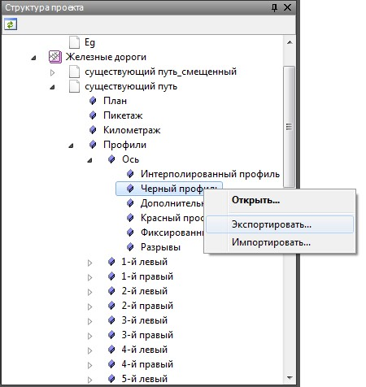

## Создание чертежа продольного профиля

В зависимости от состава работ в проекте чертеж продольного профиля может выглядеть по-разному. В программе добавлено несколько вариантов шаблона чертежа для проектирования вторых путей.

**Профиль вторые пути** – вариант, при котором достраивается второй путь без реконструкции существующего пути.

**Профиль вторые пути с реконструкцией плана** – вариант, при котором достраивается второй путь, реконструируется существующий путь, а продольный профиль по второму пути и по отрихтованному пути совпадают.

**Профиль вторые пути с реконструкцией плана и профиля** – вариант, при котором достраивается второй путь, реконструируется существующий путь, а продольный профиль по второму пути отличается от продольного профиля по отрихтованному пути на всей длине или на каких-то участках.

Чертеж продольного профиля создается для подобъекта существующего пути. Для создания чертежа выберите элемент меню **Проект – Создать чертеж – Продольный профиль**:

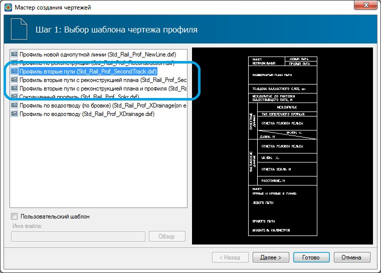

Выберите необходимый шаблон и нажмите **Далее**.

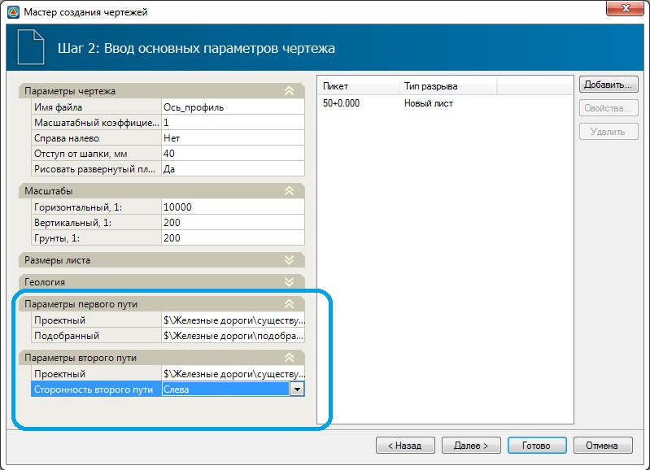

В левой части окна в низу таблицы с параметрами укажите параметры первого и второго пути. Нажмите **Готово**. Программа создаст чертеж продольного профиля:

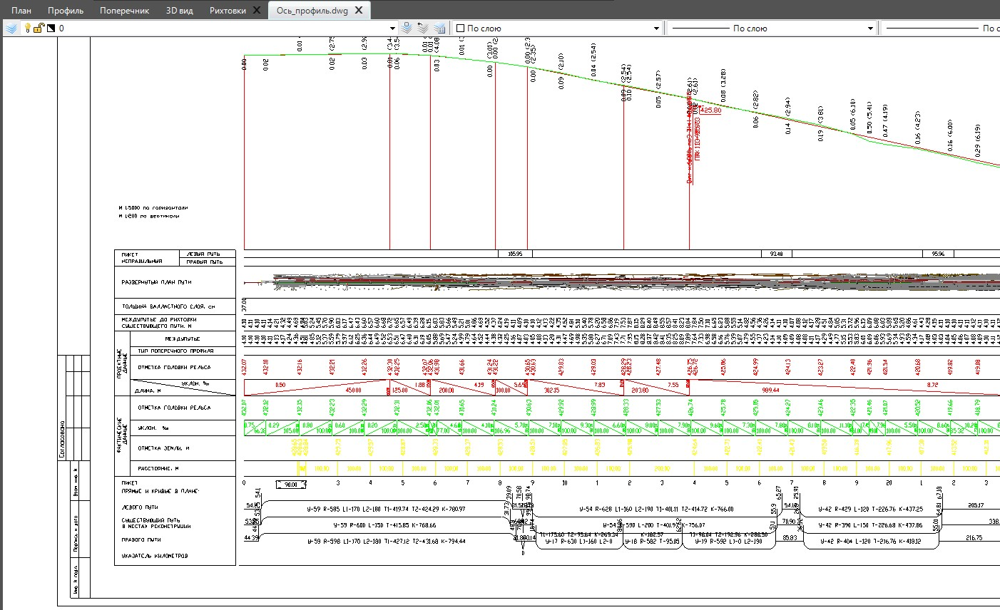

На чертеже есть некоторые характерные особенности для проектирования вторых путей:

1. В поле **Прямые и кривые** в плане по второму и отрихтованному пути пишутся реальные параметры горизонтальных кривых, но пикетажные границы элементов подписываются в пикетаже существующего пути.

   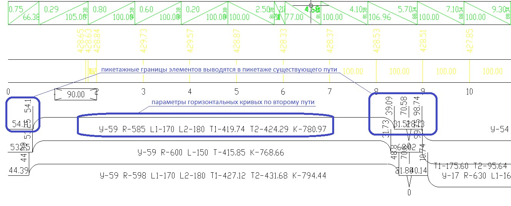

2. Так как профиль по вторым второму пути строится в подобъекте существующего пути, то длина на кривых в плане у существующего пути и второго пути отличаются. Программа автоматически пересчитывает длины элементов профиля, на которые попадает неправильный пикет по второму пути, учитывающий расхождение длин подобъектов. Ниже показано отображение одного и того же участка в окне **Профиль** и на сформированном чертеже данного продольного профиля:

   Участок на профиле:

   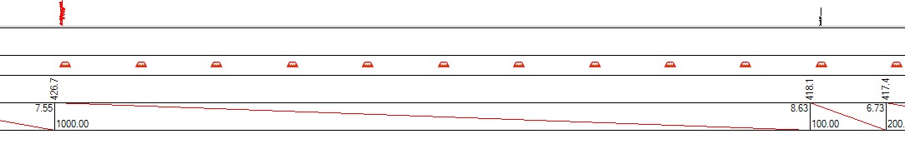

   Участок на чертеже:

   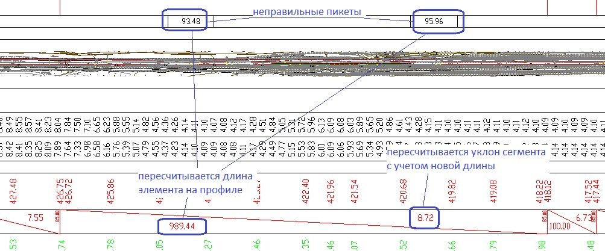

## Создание поперечных профилей

Поперечные профили проектируются в подобъекте существующего пути.

При конструировании поперечников могут частично быть использованы стандартные элементы. Не типовые элементы создаются на основе узлов и контуров.

Для удобства проектирования поперечных профилей могут быть использованы следующие особенности программы.

1. Если на поперечном профиле подобъекты соседних путей не имеют собственного проектного профиля, то они отображаются в уровне проектного продольного профиля текущего подобъекта. Если соседний путь имеет свой проектный продольный профиль, то на текущем поперечнике он отображается в уровне этого профиля:

   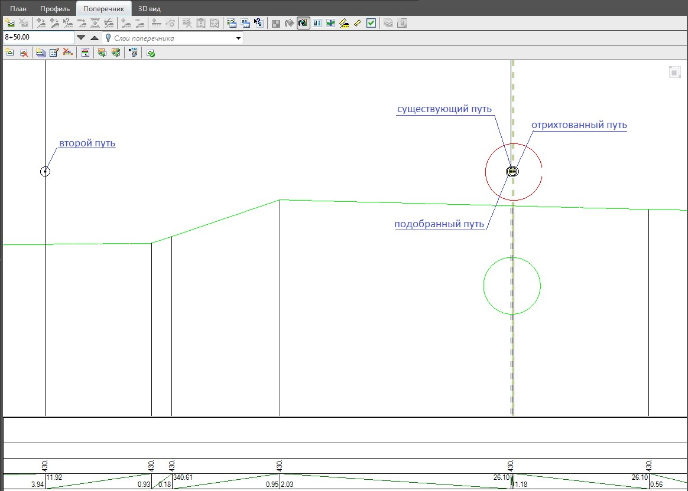

   

   Функционал по конструированию проектных поперечных профилей был подробно описан ранее. [См. Железные дороги, Проектирование поперечных профилей](../../rail_crossection/general_information.md).

   

2. При проектировании проектного поперечного профиля в текущем подобъекте, может понадобится возможность использовать значения каких либо переменных с соседнего подобъекта. Например, при проектировании проектного поперечника в текущем подобъекте (существующем пути) нужно запроектировать основную площадку и балласт для второго пути. Для того что бы основная площадка автоматически уширялась, а балласт автоматически возвышался (в соответствии с параметрами элементов плана второго пути) в свойствах этих элементов необходимо указать переменные, которые ссылаются на соответствующую таблицу уширений и возвышений. Однако, таблица уширений и возвышений находится в подобъекте второго пути.

   Поэтому, при проектировании проектного поперечника необходимо сослаться на переменные из другого подобъекта. Для этого предусмотрен специальный функционал, который подробно описан в разделе **Мастер формул**. [См. Железные дороги, Проектирование поперечных профилей](../../rail_crossection/master_formulas.md).

   Таким образом, на данном этапе мы получаем поперечники по второму пути, запроектированные в подобъекте существующего пути.

   На основе запроектированных поперечных профилей могут быть подсчитаны необходимые объемы работ и сформированы основные чертежи.