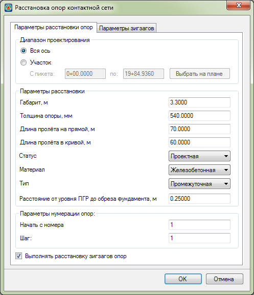
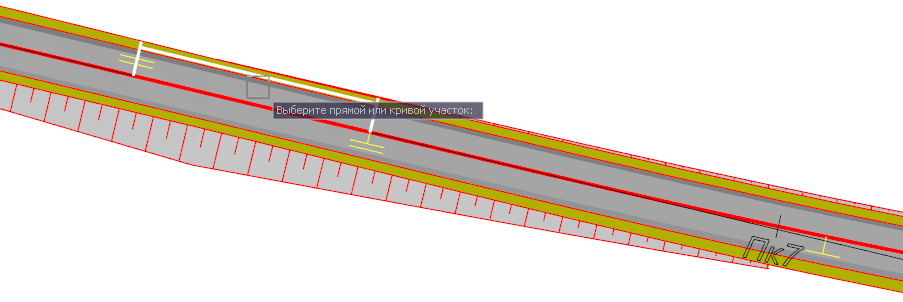
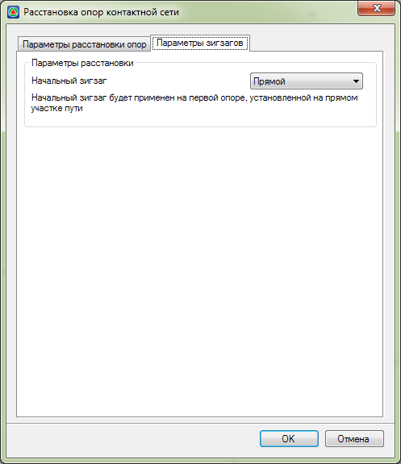

# Расстановка опор контактной сети

Для автоматической расстановки опор контактной сети:

1. Выберите меню **Задачи – Контактная сеть – Расставить опоры КС**, откроется диалоговое окно:

   

   * В поле **Диапазон проектирования** выбирается участок расстановки опор КС.

     С помощью соответствующих опций в качестве участка может быть выбран как весь путь, так и необходимый пикетажный участок.

     Выбрав опцию **Участок**, станут доступны поля для ввода пикетажного значения начала и конца участка расстановки, а также опция **Выбрать на плане**, с помощью которой можно визуально левой кнопки мыши выбрать характерный участок плана (участок переходной или круговой кривой, прямолинейный участок- будут подсвечиваться при наведении курсора):

     

   * В поле **Параметры расстановки** задаются следующие характеристики:

     Некоторые параметры схематично показаны на рисунке ниже:

     

     В поле Габарит (1) задается габаритное расстояние от оси пути до оси опоры 

     

     Положительное значение габарита определяет расстановку опор КС справа от оси пути по направлению пикетажа, а отрицательное соответственно слева.

     

     (2) – толщина опоры.

     (3) - расстояние от уровня ПГР (проектная головка рельса) до обреза фундамента.

     Длина пролета на кривой\прямой – шаг расстановки опор на прямолинейном и криволинейном участке пути.

     Статус, Материал и Тип опоры влияет на отображение условного знака опор КС и на выходные данные.

   * В поле **Параметры нумерации** задается начальный номер опоры КС и шаг с котором будет производиться нумерация последующих опор.

     

      Например, если начальный номер опоры КС задан - 1, а шаг - 2, то нумерация опор будет следующая – 1, 3, 5, …

     

   * При включении опции **Выполнять расстановку зигзагов опор** появляется дополнительная вкладка на которой задаются параметры устройства зигзагов проводов:

     

     В поле **Параметры расстановки** имеется возможность задать тип начального зигзага – **Прямой** или **Обратный**.

     

     Расстановка зигзагов производится на прямолинейном участке пути.

     

2. Задав все необходимые параметры, нажмите **ОК**. В результате программа выполнит расстановку опор КС:

   