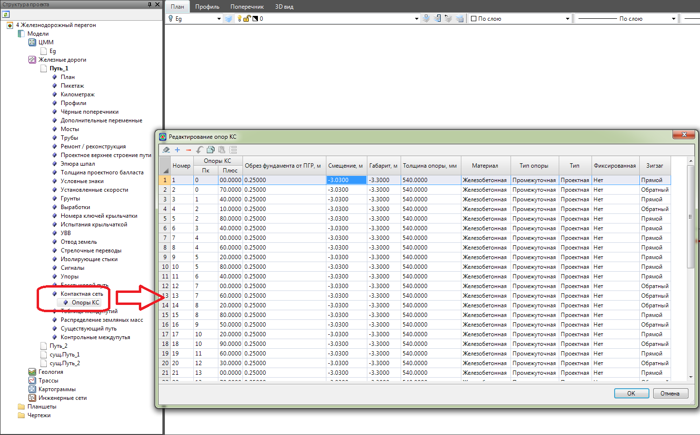
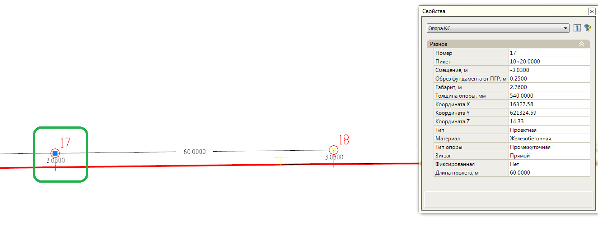
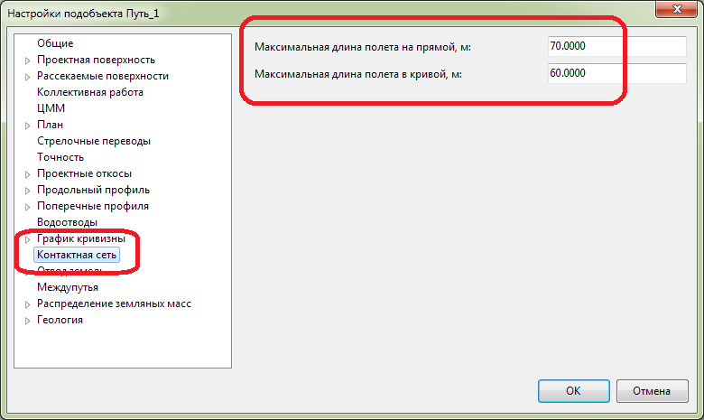

# Редактирование опор КС

Расставленные опоры КС находятся в **Структуре проекта**, в таблице **Опоры КС**, в дереве таблиц текущего подобъекта:

Данная таблица может быть использована для изменения свойств у имеющихся элементов, удаления и добавления новых элементов, используя соответствующие пиктограммы на панели данного окна:

Также редактирование характеристик опор можно осуществлять через окно **Свойства** выделенного объекта:

Свойство **Фиксированная** (Да\Нет) позволяет сохранить положение опоры при редактировании длин смежных пролетов. 



Данное свойство может использоваться для закрепления положения опор перед искусственными сооружениями.



В поле **Длина пролета** задается расстояние до следующей опоры КС. 



Максимальное расстояние пролета на прямолинейном и криволинейном участке ограничивается в Настройках подобъекта (п.к.м. в Структуре проекта на наименовании текущего подобъекта - > Настройки):


