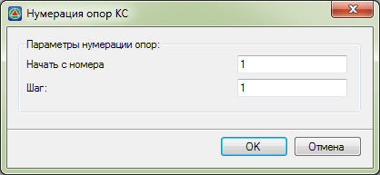

# Нумеровать опоры КС

Данная функция позволяет автоматически пронумеровать опоры КС.

Для этого:

1. Выберите меню **Задачи – Контактная сеть – Нумеровать опоры КС**, откроется диалоговое окно:

   

   

   Подробнее данные параметры были описаны в разделе

   

2. Задайте необходимые параметры и нажмите **ОК**, в результате программа пронумерует опоры КС 

   

   Параметры опор КС можно также изменить в таблице **Опоры КС**, которая находится в **Структуре проекта**, а также в окне свойств выделенного объекта, подробнее см.

   