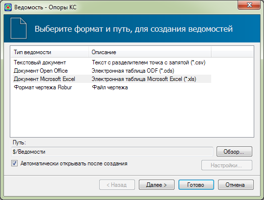
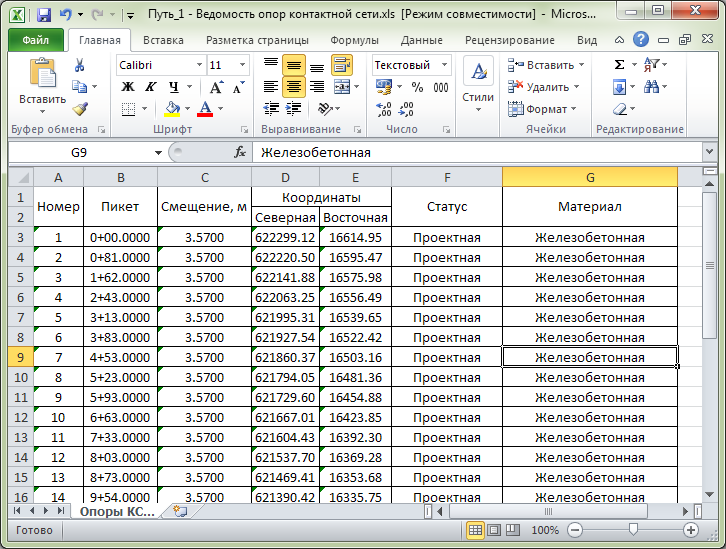

# Выходные данные

Для формирования ведомости опор КС:

1. Выберите меню **Задачи – Контактная сеть – Ведомость опор КС**:

   

2. В открывшемся окне мастера формирования ведомости задайте необходимые параметры и нажмите **Готово** В результате сформируется ведомость опор КС:

   