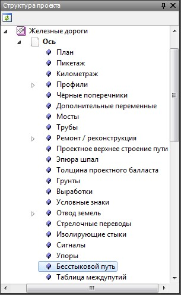
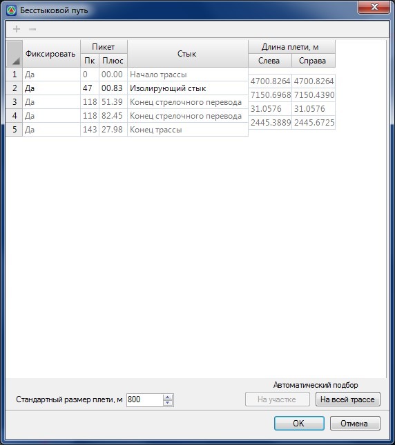
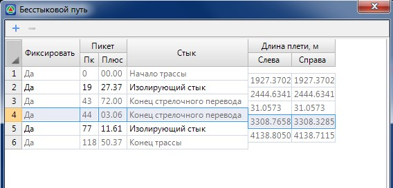
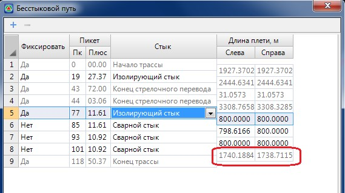
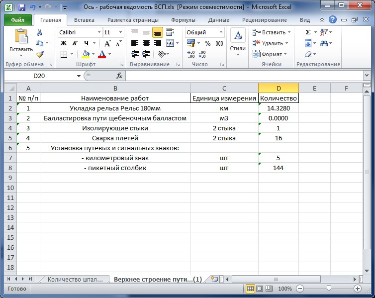
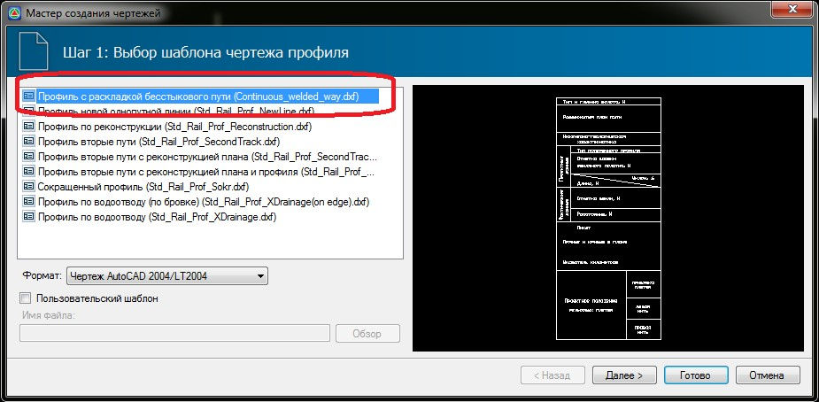
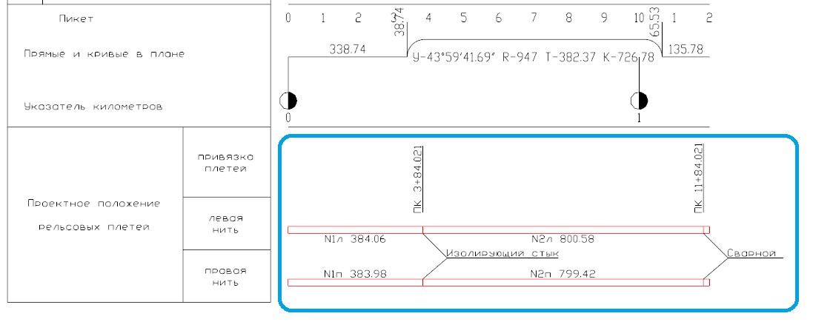

# Бесстыковой путь

Данная функция предназначена для раскладки плетей бесстыкового пути на железнодорожных перегонах с учетом изолирующих стыков и стрелочных переводов.

Таблица **Бесстыковой путь** находится в структуре проекта моделей у моделей типа **Железная дорога**:

При открытии таблицы **Бесстыковой путь** программа автоматически определяет положение изолирующих стыков и стрелочных переводов и заносит их в таблицу:

Таблица **Бесстыковой путь** может быть заполнена вручную, автоматически на участке или автоматически на всей трассе.

Перед тем как начать подбор бесстыкового пути, в нижней части окна в соответствующем поле ввода задайте **Стандартный размер плети**.

Для того что бы разложить бесстыковой путь вручную, выберите в таблице участок, на котором нужно сделать раскладку. В столбцах **Длина плети слева/справа** программа показывает общую длину плети слева и справа на выбранном участке:

Далее кнопкой  на выбранный участок добавляются плети заданной длины. В столбце **Длина плети слева/справа** программа показывает длину, оставшуюся после добавления плетей:

Плети добавляют пока оставшаяся длина не станет меньше стандартной длины плети.

Для автоматической раскладки плетей на участке. Установите курсор на участок, на котором нужно сделать раскладку и нажмите кнопку **На участке** . Программа уточнит границы участка и сделает раскладку на нем.

Для автоматической раскладки плетей на всей трассе нажмите кнопку **На всей трассе.**



 При изменении длины трассы, а также пикетажного положения стыков или стрелочных переводов, данные изменения автоматически учитываются при каждом повторном открытии таблицы **Бесстыковой путь**. Далее, при необходимости, отредактируйте раскладку плетей на измененном участке, вручную или в автоматическом режиме.



Выходным документом, содержащим данные по бесстыковому пути является **Рабочая ведомость верхнего строения пути** меню. Для ее создания воспользуйтесь элементом меню **Задачи – Верхнее строение пути – Рабочая ведомость верхнего строения пути:**

Для формирования чертежа продольного профиля с данными по раскладке плетей:

1. Выберите меню **Проект - Создать чертеж - Продольный профиль**.
2. На первом этапе формирования чертежа выберите шаблон **Профиль с раскладкой бесстыкового пути**:

   

3. В результате в нижней части чертежа будут отрисованы данные раскладки плетей:

   