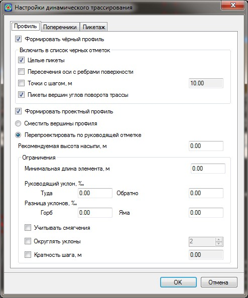
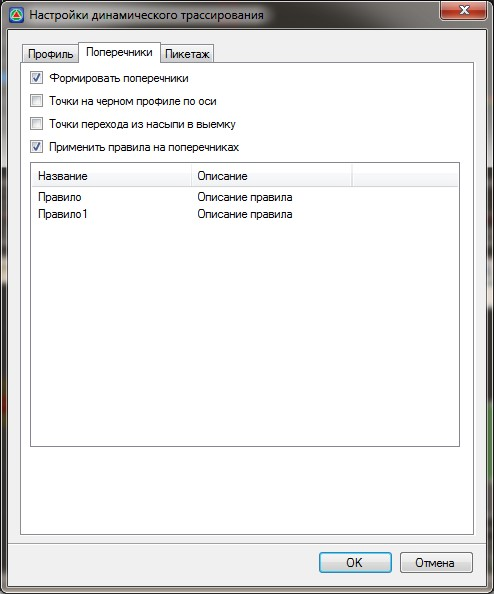
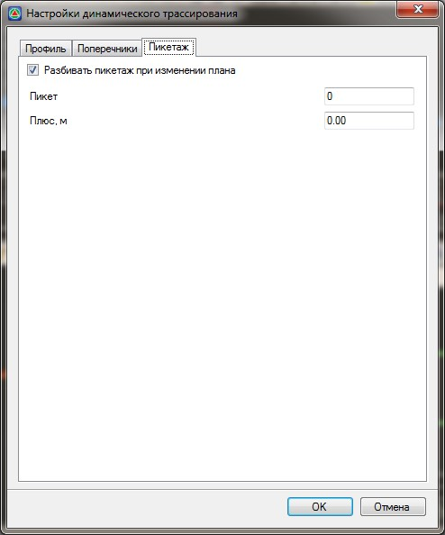

# Динамическое трассирование

Включение режима динамического трассирования позволяет при изменении плана автоматически перепроектировать с заданными параметрами модель подобъекта.

Для этого:

1. На панели управления в нижней части рабочего окна нажмите кнопку , откроется диалоговое окно:

   

   Данное диалоговое окно состоит из трех вкладок - **Профиль, Поперечники** и **План**. На каждой вкладке настраиваются параметры которые должны пересчитываться при изменении плана трассы.

   На вкладке **Профиль** настраиваются параметры перепроектирования черного и проектного профиля:

   **Формировать черный профиль** - включение данной опции позволяет при изменении плана трассы переформировать черный профиль с заданными параметрами.

   

   1. Подробно все параметры создания черного профиля описаны в Документации [Работа с трассой, Продольный профиль](../../rb_survey/alg/track_profile/create_black_profile.md).
   2. Переформировываться будут участки профиля на которых производились изменения, на участках профиля где изменений не производилось останутся не затронуты.

   

   **Формировать проектный профиль** - включение данной опции позволяет при изменении плана трассы переформировать проектный профиль с заданными параметрами.

    * Выберите опцию **Сместить вершины профиля** - если необходимо, чтобы отметки вершин профиля смещались при изменении подобъекта на величину изменения длины трассы;
    * Выберите опцию **Перепроектировать по руководящей отметке** - если необходимо перепроектировать проектный профиль изменённого участка плана трассы по руководящей отметке. При этом необходимо в соответствующих полях ввода задать параметры перепроектирования.

      

      1. Подробно все параметры проектирования продольного профиля описаны в текущем томе, [Работа с трассой, Продольный профиль. Проектирование профиля по руководящей отметке](../rail_profile/projecting_via_guidelines_point.md).
      2. Переформировываться будут участки профиля на которых производились изменения, на участках профиля где изменений не производилось останутся не затронуты.

      

   На вкладке **Поперечники** настраиваются параметры формирования черных и проектных поперечников:

   

   **Формировать поперечники** - включение данной опции позволяет при изменении плана трассы формировать черные поперечники с заданными параметрами.

   

   1. Подробно все параметры создания черных поперечников описаны в Документации [Работа с трассой, Поперечный профиль](../../rb_survey/alg/track_crossection/creating_list_diameters.md).
   2. Переформировываться будут участки трассы на которых производились изменения, на участках где изменений не производилось останутся не затронуты.

   

   **Применить правила на поперечниках** - включение данной опции позволяет при изменении плана трассы перепроектировать проектные поперечники, по одному из выбранных правил.

   

   1. Подробно все параметры проектирования поперечных профилей описаны в текущем томе,[Проектирование поперечных профилей](../rail_crossection/rules.md).
   2. Переформировываться будут участки профиля на которых производились изменения, на участках профиля где изменений не производилось останутся не затронуты.

   

   На вкладке **Пикетаж** настраиваются параметры пересчета пикетажа:

   

   **Разбить пикетаж при изменении плана** - включение данной опции позволяет переразбить пикетаж с заданными параметрами.

   

   Подробно все параметры описаны в документации [Работа с трассой, План трассы](../../rb_survey/alg/plan_track/plan_track.md).

   