# Создание междупутий

Настройка отображения междупутных расстояний задается в свойствах текущей трассы, в таблицы междупутий. Данная таблица содержит список подобъектов, между которыми необходимо отображать меджупутные расстояния.



1. Для отображения междупутных расстояний между текущим подобъектом, он также должен быть добавлен в таблицу междупутий.
2. Как правило, текущий путь для которого заполняется таблица междупутий, является главным. Междупутные расстояния измеряются между соседними осями, но по нормали к главному пути.



Для того чтобы добавить междупутье:

1. Сделайте текущим соответствующий подобъект и выберите меню **Задачи – Междупутья – Таблица междупутий**. Откроется следующие окно:

   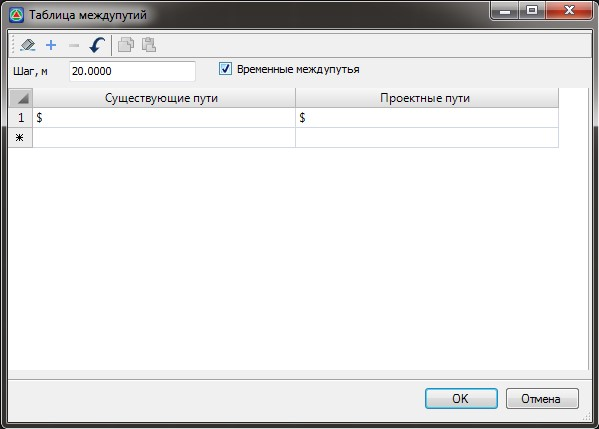

   **Шаг, м** – задается шаг отображения междупутных расстояний в окне **План**.

   Временные междупутья – включение\выключение отображения временных междупутных расстояний.

   

   Междупутья рассчитываются с заданным шагом от целых пикетов, относительно того подобъекта в котором заполнена таблица **Междупутий.**

   

2. Заполните таблицу Междупутий и нажмите **ОК**.

В результате, между заданными подобъектами в таблице Междупутий будут отображаться междупутные расстояния.

При различной конфигурации подобъектов в таблице Междупутий возможны различные варианты подписей междупутных расстояний.

Всего возможно пять различных комбинаций подобъектов в списке и три варианта подписей:

* Только проектное междупутье:

  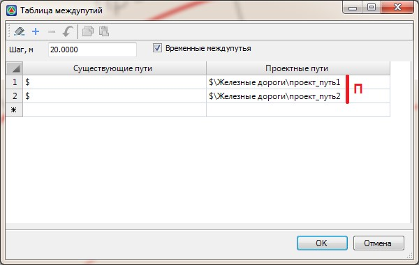

  В данном случае будет отображаться только проектное междупутье между заданными подобъектами, т.е. форма записи междупутных расстояний будет следующая - П:

  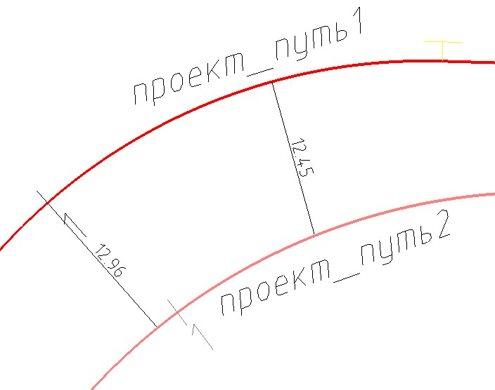

* Только существующее междупутье:

  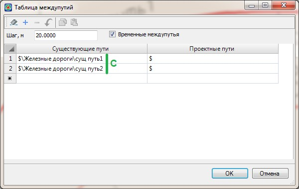

  В данном случае, в скобках, будет отображаться только существующее междупутье между заданными подобъектами, т.е. форма записи междупутных расстояний будет следующая – (С):

  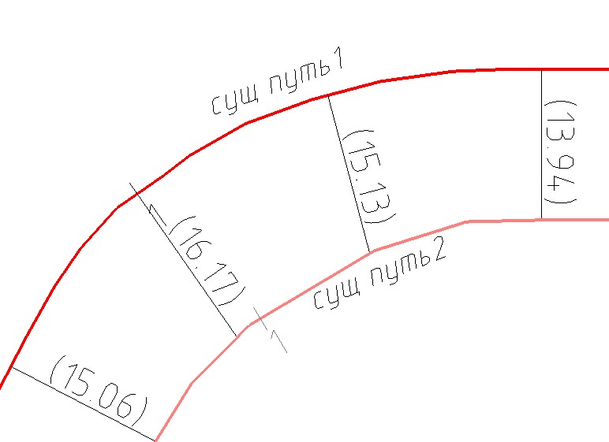

* Проектное и временное междупутье:

  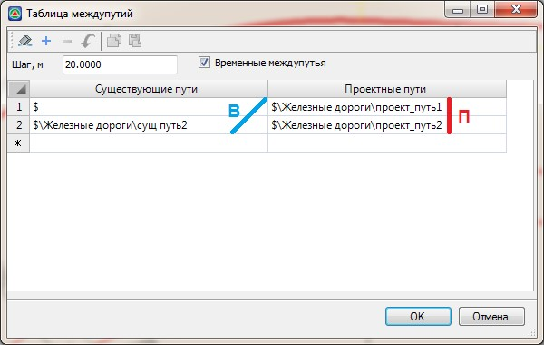

  В данном случае, будет отображаться проектное междупутье, а также при включении соответствующей опции, в скобках временное междупутье между заданными подобъектами т.е. форма записи междупутных расстояний будет следующая – П (В):

  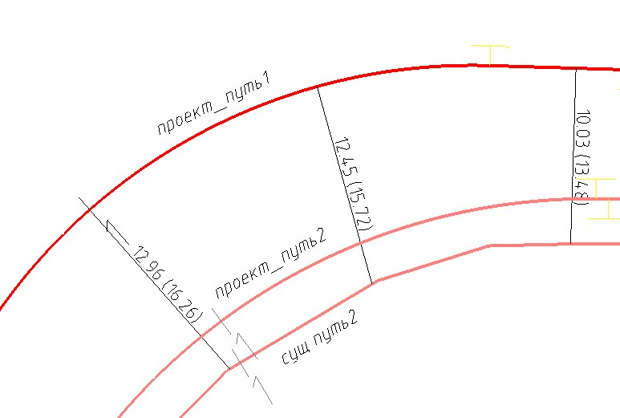

* Проектное и существующее междупутье:

  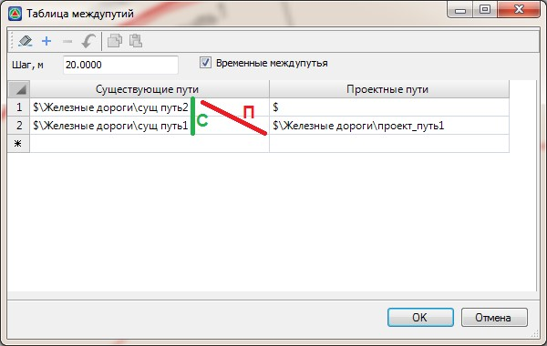

  В данном случае будет отображаться проектное междупутье и в скобках существующее междупутье, т.е. форма записи междупутных расстояний будет следующая – П (С):

  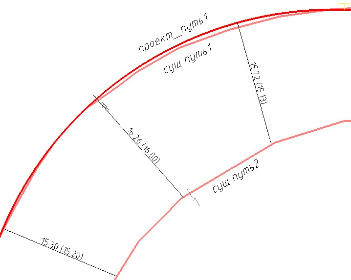

* Проектное, существующее и временное междупутье:

  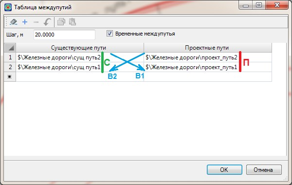

  В данном случае будет отображаться проектное, в скобках существующее и два временных междупутий, т.е. форма записи междупутных расстояний будет следующая – П (С, В1, В2):

  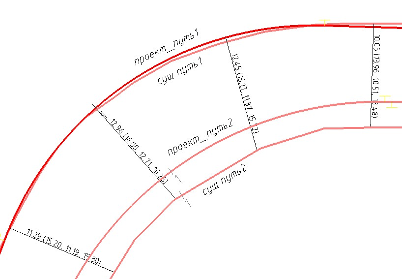

Заданные междупутные расстояния отображаются в окне **Поперечник**:

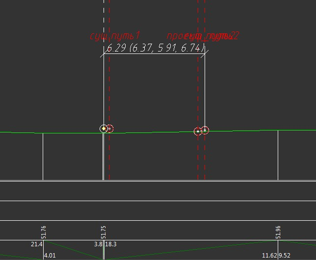