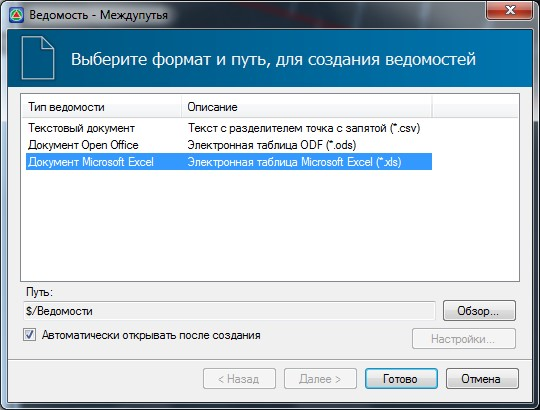
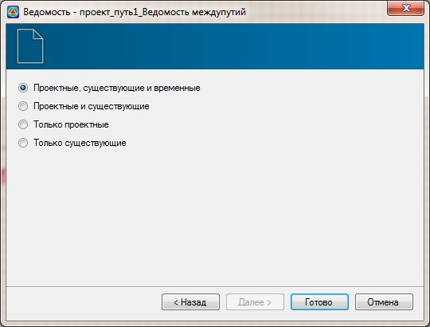

# Формирование ведомости междупутных расстояний

Для создания ведомости междупутий:

1. Выберите элемент меню **Задачи - Междупутья - Ведомость междупутий**, откроется диалоговое окно:

   

2. В появившемся мастере формирования ведомостей выберите формат создаваемой ведомости и нажмите **Далее**, откроется диалоговое окно:

   

3. Выберите необходимый вариант формирования ведомости и нажмите **Готово**.

В результате программа сформирует ведомость междупутий и откроет ее в соответствующем редакторе.