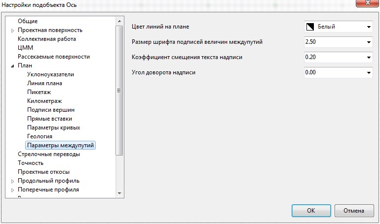

# Настройка отображения междупутных расстояний

Имеется возможность настроить цвет и размер подписей междупутных расстояний.

Для этого:

1. В **Настройках** текущего подобъекта выберите пункт **Параметры Междупутий**:

   

   **Коэффициент смещения текста надписи** – в данном поле ввода задается величина смещения подписи междупутного расстояния относительно размерной линии.

   

   Может быть задано как положительное значение, так и отрицательное, в результате чего подпись будет располагаться либо над линией, либо под линией.

   

   В выпадающем списке Угол доворота надписи имеется возможность задать дополнительный угол поворота подписи междупутного расстояния, который задается относительно линии.

   

   В данном окне задаются настройки текущей модели подобъекта **Железные дороги**. Для задания настроек по умолчанию для вновь создаваемых моделей, а также общих настроек проекта, воспользуйтесь элементом меню **Сервис - Настройки.**

   

2. Выполните необходимые настройки и нажмите **Ок**.