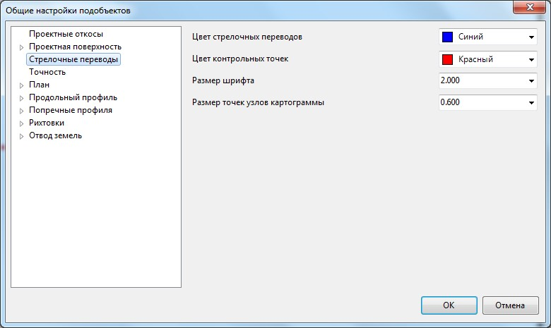

# Настройка отображения стрелочных переводов

Для настройки отображения стрелочных переводов, размера подписей и т.д.:

1. В окне **Структура проекта** щелкните правой кнопкой мыши по наименованию текущей модели подобъекта и выберите из появившегося контекстного меню пункт **Настройки**.
2. В открывшемся окне перейдите на вкладку **Стрелочные переводы**:

   

   

   В данном окне задаются настройки текущей модели подобъекта **Железные дороги**. Для задания настроек по умолчанию для вновь создаваемых моделей, а также общих настроек проекта, воспользуйтесь элементом меню **Сервис - Настройки.**

   

3. При необходимости в соответствующих выпадающих списках задайте цвет стрелочных переводов и контрольных точек, укажите размер шрифта подписей стрелочных переводов и размер узлов контрольных точек.
4. Для применения заданных настроек нажмите **ОК**.