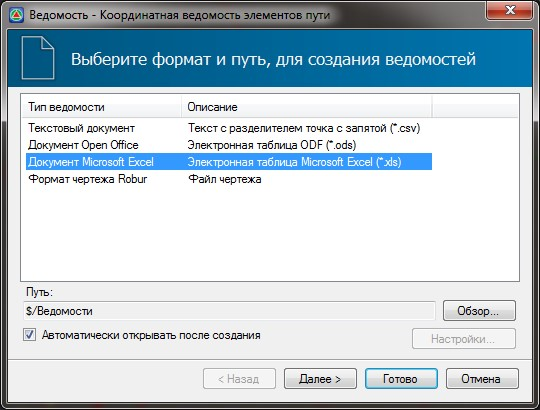
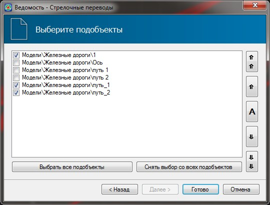
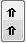
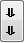
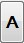
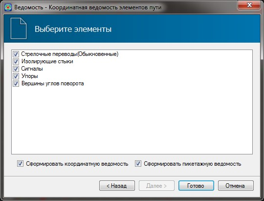
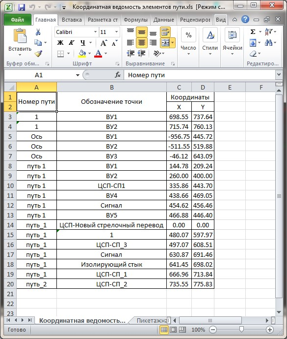

# Создание ведомостей

Имеется возможность формирования несколько типов ведомостей: **Ведомость Стрелочных переводов**, **Железнодорожных путей** и **Координатной ведомости элементов пути**.

Ниже, в качестве примера, подробно рассмотрим каждый шаг формирования **Координатной ведомости элементов пути**.



Остальные ведомости формируются аналогичным образом.



1. Для формирования ведомости выберите меню **Задачи - Станции - Ведомости - Координатная ведомость элементов пути.**
2. В открывшемся окне выберите формат и место сохранения ведомости:

   

   Произведите необходимые настройки и нажмите **Далее**.

3. В открывшемся окне галочками отметьте модели подобъектов по которым необходимо произвести сбор данных и сформировать ведомость:

   

   Формирование данных в ведомости будет производится по списку подобъектов сверхувниз. Порядок формирования данных можно менять соответствующими кнопками:

   Кнопки  и  позволяют переместить выделенный подобъект в верх или низ списка соответственно.

   Кнопки  и  позволяют перемещать выделенный подобъект по списку на один пункт вверх или вниз соответственно.

   Кнопка  позволяет автоматически в списке упорядочить модели подобъектов по их названиям. Упорядочение производится в порядке - вначале римские цифры, затем арабские цифры, и уже затем подобъекты с названиями из буквенных символов.

   Кнопки **Выбрать все подобъекты** и **Снять выбор со всех подобъектов** позволяют быстро снять и установить галочки напротив всех элементов в списке. Подобъекты которые не были выбраны не будут участвовать в формировании ведомостей.

4. Произведите необходимые настройки и нажмите **Далее**. Откроется окно выбора элементов путей:

   

5. Отметьте галочками элементы путей, которые необходимо включить в ведомость.

   При необходимости формирования координатной и пикетажной ведомости установите соответствующие галочки.

6. Произведите соответствующие настройки и нажмите **Готово**. В результате программа сформирует ведомость и откроет ее в соответствующем редакторе:

   