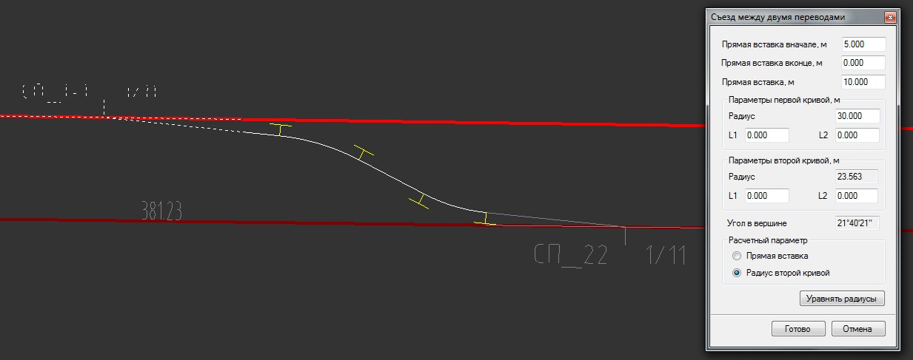
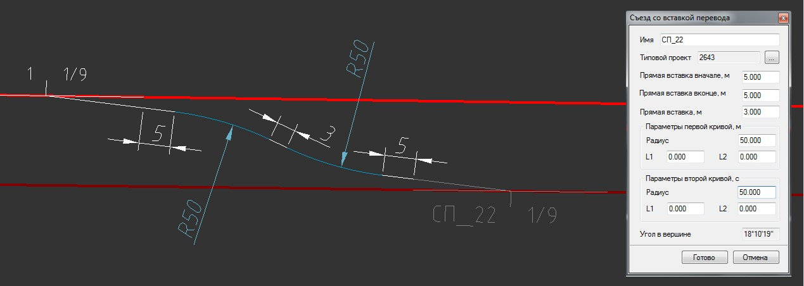
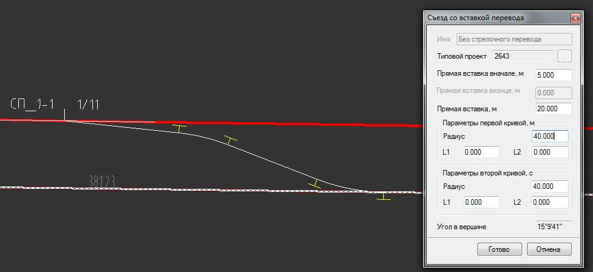

# Проектирование съездов

Функционал для проектирования съездов включает в себя набор сопряжений, с помощью которых имеется возможность проектировать съезды различной конфигурации.

Создание съезда включает в себя два этапа:

1. Проектирование необходимой конфигурации съезда из набора сопрягающихся элементов (отрезки, арки, клотоиды).
2. Создание из данного набора сопрягающихся элементов оси железнодорожного подобъекта.

## Первый этап:

Для проектирования съездов в программе предусмотрено два типа сопряжений:

* Сопряжение с двумя радиусами.
* Сопряжение с одним радиусом.

Перечисленные выше типы сопряжений имеют идентичную последовательность задания параметров, отличия состоят только в наборе сопрягающих элементов, поэтому ниже рассмотрим порядок проектирование съезда с двумя радиусами. Для этого:

1. Выберите меню **Задачи - Станции - Сопряжения - Съезд с двумя радиусами**, курсор примет форму прицела, укажите стрелочный перевод, от которого необходимо построить съезд, откроется контекстное меню:

   

   * Выберите **Указать второй перевод**, в случае когда стрелочный перевод предварительно был добавлен на второй путь. Курсор примет форму прицела, укажите стрелочный перевод второго пути, в открывшемся окне задайте параметры сопряжения:

     

   * При необходимости вставки нового стрелочного перевода на второй путь, выберите опцию **Вставить второй перевод**. Далее необходимо выбрать путь и участок вставки стрелочного перевода. В открывшемся окне выберите типовой проект стрелочного перевода и задайте параметры сопряжения:

     

   * При необходимости сопряжения со вторым путем без вставки стрелочного перевода выберите соответствующий пункт меню **Без стрелочного перевода**. Курсор примет форму прицела, выберите второй путь и укажите участок сопряжения, откроется диалоговое окно:

     

2. После выбора схемы и задания параметров сопряжения нажмите **Готово**. Программа произведет сопряжение с заданными параметрами и отрисует съезд в окне **План**, состоящий из набора сопрягающихся элементов (отрезков, дуг, клотоид). Если был выбран вариант со вставкой второго перевода, программа добавит стрелочный перевод на второй путь.

## Второй этап

Для создания оси железнодорожного подобъекта из набора сопрягающихся элементов выберите меню **План - Создать ось из примитивов**, предварительно создав новый подобъект типа **Железная дорога** в cтруктуре проекта. Последовательность действий по созданию оси из набора примитивов описывалась в [План трассы](../../../rb_survey/alg/plan_track/plan_track.md).