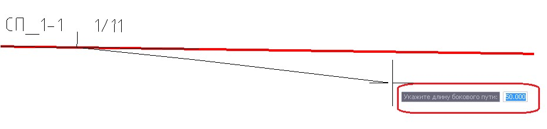

# Отрисовка бокового пути

Функция предназначена для отрисовки бокового пути, в качестве прямолинейного отрезка заданной длины, от выбранного стрелочного перевода .

Для этого:

1. Выберите меню **Задачи - Станции - Нарисовать боковой путь**, курсор примет форму прицела. Левой кнопкой мыши выберите стрелочный перевод.
2. В строке динамического ввода укажите длину бокового пути, либо визуально укажите длину создаваемого отрезка с помощью левой кнопки мыши:

   

В результате программа создаст прямолинейный отрезок заданной длины, от выбранного стрелочного перевода, который может быть использован для дальнейших плановых построений.