# Редактирование горловины станции

Данный блок функций предназначен для работы с несколькими путями. В частности, реализованы функция поворота и удлинения группы осей относительно заданной или их сопряжения друг с другом

## Создать горловину станции

Функция предназначена для создания, удлинения и поворота группы путей.

Для этого:

1. Выберите меню **Задачи - Станции - Создать горловину станции**, курсор примет форму прицела, укажите главный подобъект, относительно которого будет производиться поворот или удлинение:

   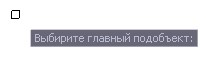

2. Укажите пикет на главном пути, относительно которого будет модифицироваться горловина:

   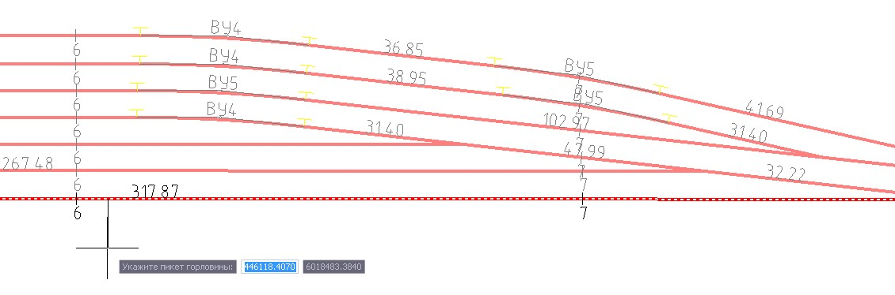

3. Задайте направление горловины, в сторону которого будут производиться удлинение и поворот:

   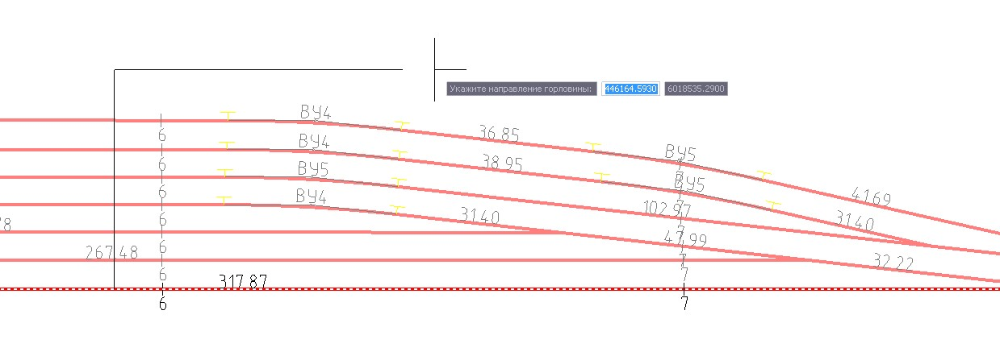

4. Поочередно выберите подобъекты путей, которые будут участвовать в модификации горловины и нажмите **Enter**:

   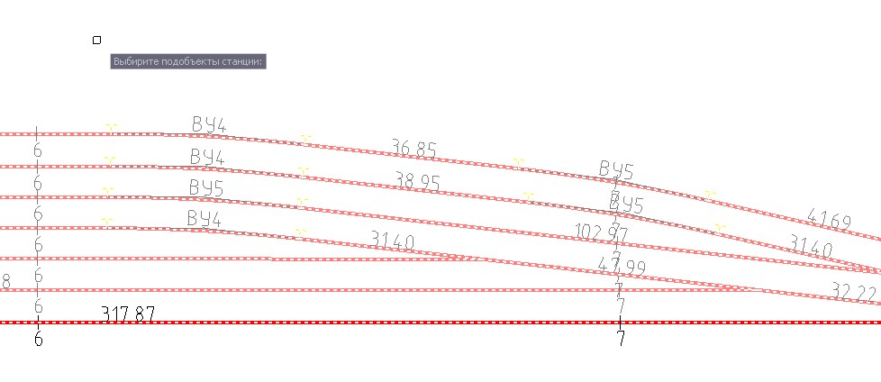

5. Откроется окно параметров модификации горловины станции:

   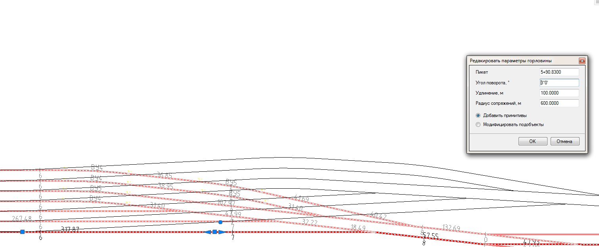

   * **Пикет** - для изменения пикета точки начала удлинения горловины (при ее удлинении) или угла поворота (при ее повороте и удлинении). Пикет задается на главном пути.
   * **Угол поворота** - задается величина угла поворота горловины.
   * **Удлинение** - величина удлинения горловины станции относительно заданного пикета.
   * **Радиус сопряжений** - величина радиуса сопрягающей кривой при повороте горловины станции.
   * **Добавить примитивы** - если выбрана данная опция, то после нажатия кнопки ОК, модифицируемые трассы останутся неизменными, а созданные построения будут отрисованы на плане в виде примитивов чертежа.
   * **Модифицировать подобъекты** - если выбрана данная опция, то исходные пути будут перестроены согласно заданным параметрам.

6. Задайте необходимые параметры и нажмите **Ок**. В зависимости от них программа произведет отрисовку сопряжений примитивами или модифицирует сами оси с учетом заданных параметров удлинения, поворота и сопряжений:

   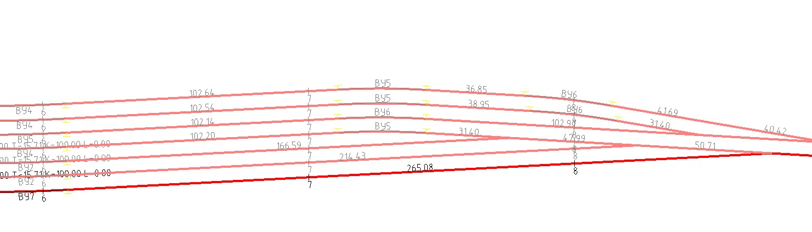

## Сопряжение подобъектов

Функция позволяет производить сопряжение двух заданных осей.

Для этого:

1. Выберите меню **Задачи - Станции - Горловина станции - Сопрячь подобъекты**, курсор примет форму прицела, укажите подобъекты в последовательности - сначала подобъект который необходимо сопряч, затем подобъект с которым выполняем сопряжение:

   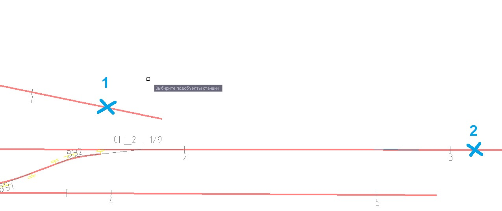

2. В открывшемся окне параметров сопряжения задайте необходимые параметры и нажмите **Готово**:

   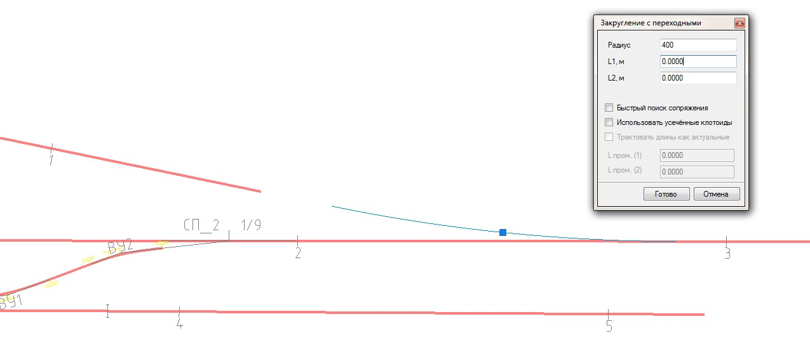

   

   Подробно все параметры сопряжения были описаны в документации [Работа с трассой](../../../rb_survey/alg/plan_track/redactor_conjugation/joining_primitives.md).

   

3. Появится дополнительный список параметров создаваемого сопряжения:

   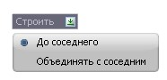

   * **До соседнего** - при выборе данной опции программа выполнит сопряжение с заданными параметрами, модифицировав сопрягаемый подобъект до соседнего и переразобъет пикетаж:

     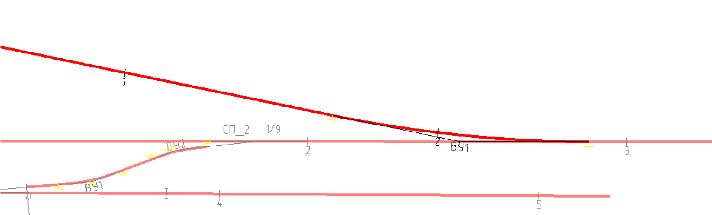

   * **Объединять с соседним** - при выборе данной опции программа выполнит сопряжение с заданными параметрами, объединив две трассы в одну общую, при этом, для сохранения исходного пикетажа на втором пути, будет автоматически введен резаный пикет:

     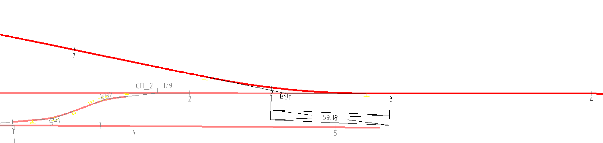

4. Выберите необходимый вариант сопряжения и нажмите **Ок**. В результате программа выполнит сопряжение и модифицирует оси по заданной схеме.