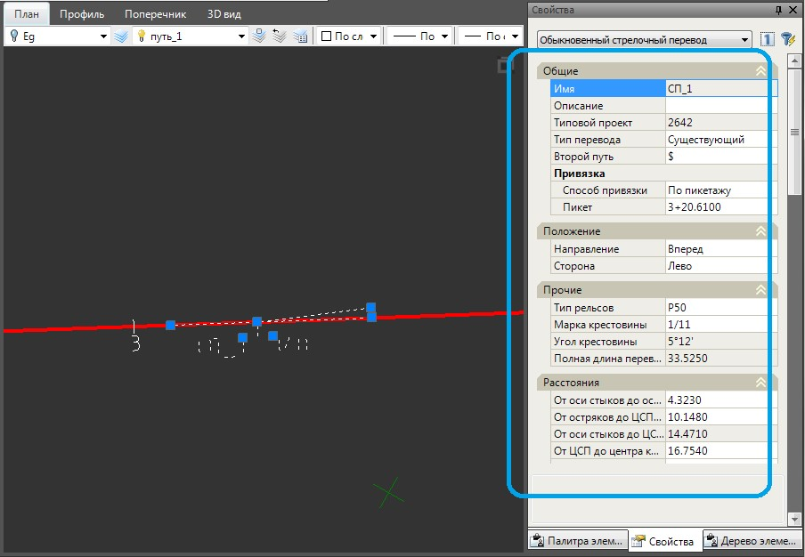
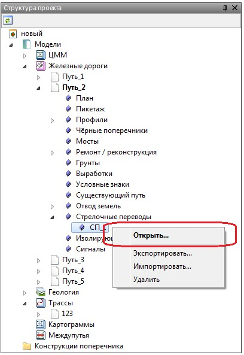
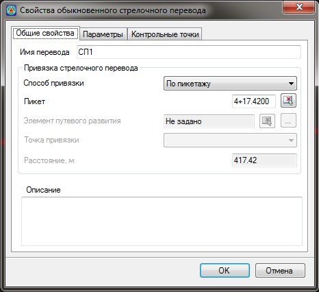
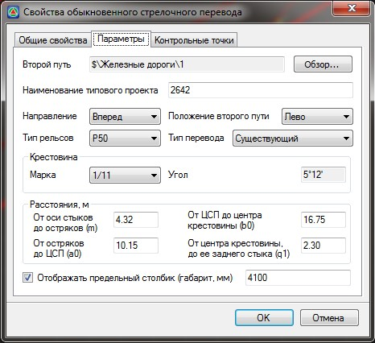
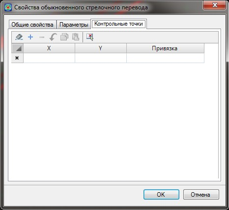
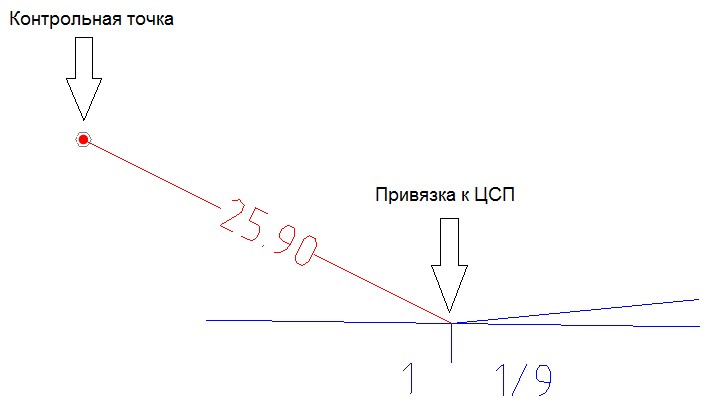

# Редактирование стрелочного перевода

Параметры добавленных стрелочных переводов можно отредактировать двумя способами:

l. Через окно свойств выбранного элемента (стрелочного перевода):

Для этого, в окне **План** выделите необходимый стрелочный перевод, который нужно отредактировать, в окне Свойства отобразятся параметры выбранного стрелочного перевода:

2. Через окно **Свойства** выбранного стрелочного перевода в **Структуре проекта**:

Для этого:

1. В окне **Структура проекта** раскройте дерево таблиц текущего подобъекта. В группе таблиц **Стрелочные переводы** щелкните правой кнопкой мыши по наименованию редактируемого стрелочного перевода, в открывшемся контекстном меню выберите пункт **Открыть**:

   

   

   Для быстрого открытия окна **Свойств** перевода достаточно дважды щелкнуть левой кнопкой мыши по его наименованию.

   

2. Окно **Свойств** выбранного стрелочного перевода состоит из трех вкладок:

### Вкладка Общие свойства

**Имя перевода** - поле ввода для изменения имени созданного стрелочного перевода

В поле **Привязка стрелочного перевода** имеется возможность задать вычисление местоположения стрелочного перевода несколькими способами: по пикетажу и относительно элементов путевого развития (предельные столбики, изостыки, сигналы, упоры, стрелочные переводы).

* Для привязки стрелочного перевода по пикетажу: в выпадающем списке **Способ привязки** выберите - **По пикетажу**, в соответствующем поле ввода задайте пикет или визуально укажите его с помощью кнопки .
* Для привязки стрелочного перевода относительно элементов путевого развития:

  1. В выпадающем списке **Способ привязки** выберите - **По расстоянию**, станут активными поля **Элемент путевого развития**, **Точка привязки** и **Расстояние**.
  2. **Элемент путевого развития** можно выбрать как визуально, указав его в окне **План**, так и выбрать из списка объектов, с помощью соответствующих кнопок 
  3. При выборе **Стрелочного перевода** в качестве элемента путевого развития, имеется возможность задать его точку привязки при вставки. В выпадающем списке **Точка** привязки выберите **Центр, Начало, Конец** элемента или **Предельный столбик**.
  4. В поле **Расстояние** укажите значение расстояния до стрелочного перевода от заданного элемента путевого развития или его элемента (если в качестве элемента выбран стрелочный перевод).

### Вкладка Параметры:

 



Данные параметры стрелочного перевода уже подробно рассматривались выше, [см. п. Вставка стрелочных переводов](insert_turnouts.md).



### Вкладка Контрольные точки:

Данная вкладка предназначена для контроля расстояний (габаритов) от произвольных объектов до элементов стрелочного перевода:

В столбцах **Х** и **У** задаются координаты контрольной точки, от которой будет считаться расстояние (габарит). Значения координат в данных столбцах можно ввести вручную, либо воспользоваться кнопкой  на панели инструментов, визуально указав точку с плана. В данном случае программа рассчитает координаты и автоматически занесет их в соответствующую строку таблицы.

**Привязка** - в данном выпадающем списке имеется возможность задать привязку задаваемой контрольной точки к различным элементам стрелочного перевода. В результате габарит будет измеряться от контрольной точки до выбранного элемента стрелочного перевода.

Пример задания контрольной точки с привязкой к **ЦСП**:

3. Настройте необходимые параметры в окне Свойств стрелочного перевода и нажмите **Ок**.