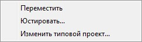
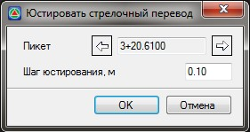

# Редактирование стрелочного перевода через контекстное меню

При нажатии правой кнопкой мыши на выделенном стрелочном переводе откроется контекстное меню:

* **Переместить** - опция предназначена для визуального перемещения стрелочного перевода с помощью мыши вдоль подобъекта.
* **Юстировать** - опция предназначена для перемещения стрелочного перевода вдоль подобъекта с заданным шагом. Выбрав данную опцию откроется диалоговое окно **Юстирования** стрелочного перевода:

  

С помощью кнопок  и  производится перемещение стрелочного перевода вдоль подобъекта.

В поле **Шаг юстирования** задается шаг перемещения стрелочного перевода.

* **Изменить типовой проект** - для выбора другого типового проекта.