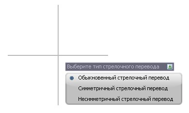
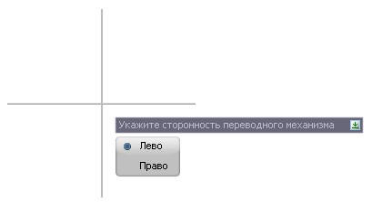

# Вставка СП по точкам

Вставка стрелочного перевода может осуществляться визуально (с привязкой) по указанным характерным точкам стрелочного перевода. Функция используется при вставке существующих стрелочных переводов.

Для вставки стрелочного перевода по точкам:

1. Выберите меню **Задачи – Станции – Добавить стрелочный перевод – То точкам**, курсор примет форму прицела.

2. Укажите характерные точки стрелочного перевода в порядке:

   * Рамный рельс.
   * Начало остряка.
   * Ближняя точка прямого пути.
   * Дальняя точка прямого пути.
   * Ближняя точка бокового пути.
   * Дальняя точка бокового пути.

3. Выберите тип стрелочного перевода:

   

4. Укажите сторонность переводного механизма:

   

В результате будет добавлен стрелочный перевод. В случае, если определяемый угол между прямым и боковым направлениями совпал (с учетом погрешности*) с маркой крестовины, то в поле Описание марки она будет указана. *Погрешность равна ¼ градуса.
