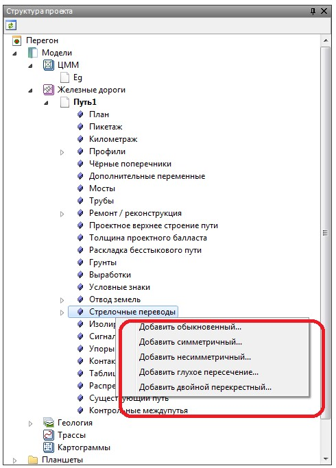
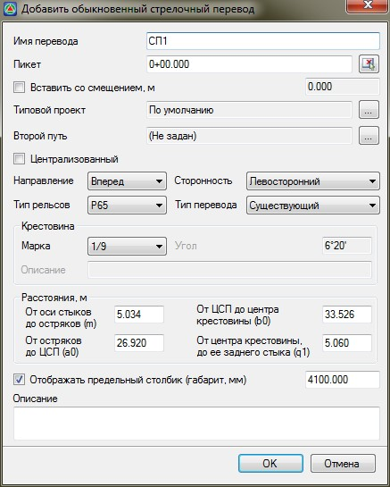
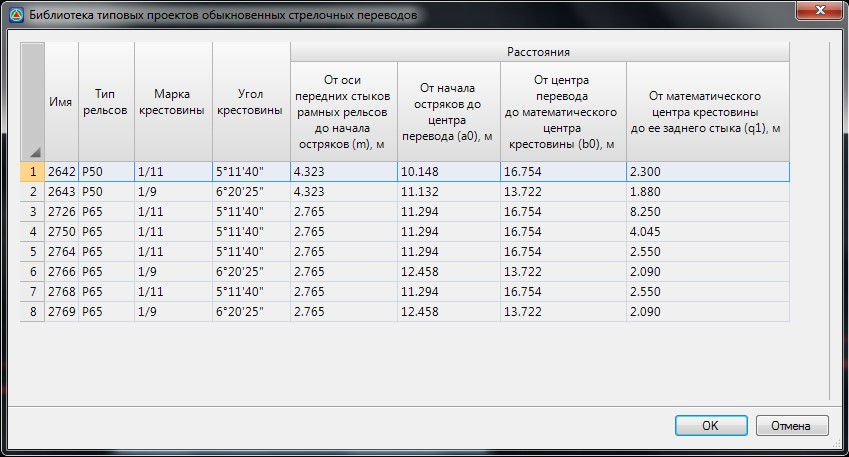
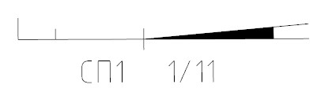
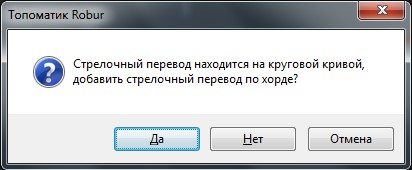
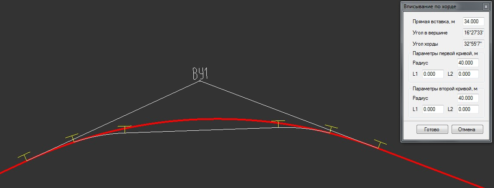
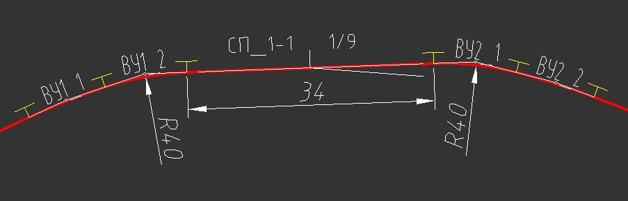
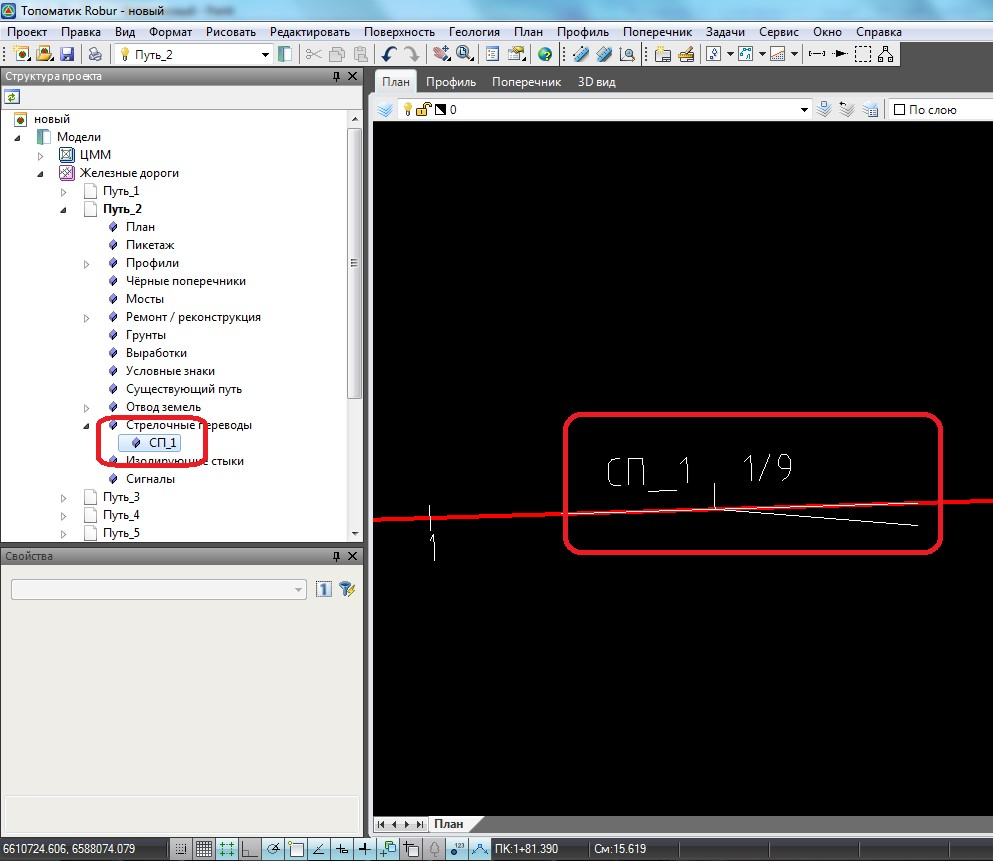

# Вставка стрелочных переводов

Для вставки стрелочного перевода выполните следующее:

1. Выберите меню **Задачи - Станции - Добавить обыкновенный стрелочный перевод**...



1. В программе реализована возможность вставки различных типов стрелочных переводов (симметричный, несимметричный и т.д.), все они вставляются аналогично, поэтому для примера, подробно будет описана вставка только обыкновенного стрелочного перевода.
2. Добавить стрелочный перевод можно через **Структуру проекта**, для этого: в окне **Структура проекта** разверните дерево таблиц текущего подобъекта, куда будет вставлен стрелочный перевод. Щелкните правой кнопкой мыши на таблице **Стрелочные переводы** и выберите **Добавить**:

   



2. В открывшемся диалоговом окне необходимо задать параметры добавляемого стрелочного перевода:

   

   * **Имя перевода** - в данном поле введите название добавляемого стрелочного перевода.
   * **Пикет** - поле ввода, в котором задается пикет вставки стрелочного перевода. Выбрав кнопку  имеется возможность вставить стрелочный перевод визуально, в окне **План**, с помощью мыши, указав точку вставки, направление стрелочного перевода и направление второго пути.
   * **Вставить со смещением** - включение данной функции позволяет добавить стрелочный перевод с возможностью задания смещения относительно точки вставки (пикета) стрелки. Например, если необходимо вставить стрелочный перевод от границы кривой на определенном расстоянии.

     

     Положительное значение величины смещения сдвинет вставляемый стрелочный перевод относительно точки вставки по ходу пикетажа, отрицательная величина смещения - против.

     

   * **Типовой проект** - в программе предусмотрена встроенная библиотека стрелочных переводов. Для выбора типового стрелочного перевода нажмите соответствующую кнопку  , откроется **Библиотека типовых проектов**:

     

     Выберите необходимый типовой стрелочный перевод и нажмите **ОК**.

     

     Описание последовательности действий по добавлению новых элементов в библиотеку типовых проектов стрелочных переводов будет рассмотрено ниже в [п. Библиотека стрелочных переводов](library_turnouts.md).

     

   * **Второй путь** - данная функция используется для задания второго (бокового) пути, который предназначен для расчета габарита и вставки предельного столбика.

     При включении опции **Централизованный стрелочный перевод** отображается соответствующим условным знаком с заливкой хвостовой части:

     

   * **Направление перевода** - в выпадающем списке выберите направление перевода (вперед или назад), которое задается относительно направления пикетажа подобъекта, на который вставляется стрелка.
   * **Положение второго пути** - выберите направление второго пути (влево или вправо), которое задается также относительно направления пикетажа текущего подобъекта .
   * **Тип рельсов** - выбирается из выпадающего списка. Данный параметр используется при формировании выходных ведомостей.
   * **Тип стрелочного перевода** - в данном выпадающем списке имеется возможность задать тип стрелочного перевода. Выбранный тип перевода учитывается при формировании выходных ведомостей.
   * **Марка** - из выпадающего списка можно выбрать стандартную марку крестовины. При выборе типа марки **Другая** в соответствующем поле ввода имеется возможность задать значение угла отличное от стандартного.

     В поле **Расстояния** все данные заполнены согласно выбранного типового проекта из библиотеки стрелочных переводов. При необходимости их можно изменить.

   * **Отобразить предельный столбик** - включение данной опции позволяет отобразить предельный столбик. Суммарная величина габарита от оси главного пути и бокового пути задается в соответствующем поле ввода.

     

     Для отображения предельного столбика необходимо указать боковой путь.

     

   * **Описание** - информационное поле ввода, предназначенное для дополнительного описания стрелочного перевода.

3. Задав все необходимые параметры вставки стрелочного перевода нажмите **ОК**.



 В случае если вставка стрелочного перевода производится на кривой (радиусе), то после нажатия **Ок** в окне добавления перевода появится предупреждение:



\- Нажмите **Нет** или **Отмену** для того чтобы перейти к этапу **Добавления стрелочного перевода** и изменить параметры вставки перевода.

\- Нажмите **Да**, если необходимо произвести вставку стрелочного перевода по хорде. В этом случае откроется диалоговое окно:

Задайте параметры вписывания сопряжения и нажмите **Готово**:

Программа произведет разбивку кривой на две составные многорадиусные кривые и между ними на прямой вставке добавит стрелочный перевод.

В результате, программа вставит стрелочный перевод на текущий подобъект. Также стрелочный перевод отобразится в виде дополнительного элемента в **Структуре проекта**, в таблице **Стрелочные переводы** соответствующей модели **Железной дороги**:

