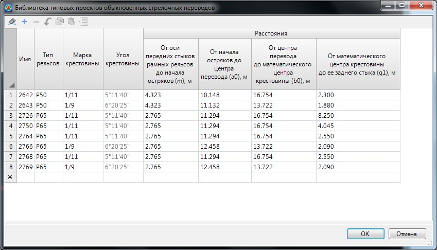
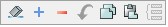

# Библиотека стрелочных переводов

Библиотека содержит набор параметров по стрелочным переводам. Все данные в Библиотеке являются редактируемыми, т.е. имеется возможность изменения параметров имеющихся, так и добавления собственных типовых проектов стрелочных переводов.



 В программе предусмотрены библиотеки для каждого типа стрелочных переводов (симметричный, несимметричный и т.д.). Редактирование данных во всех библиотеках осуществляется аналогично, поэтому ниже будет рассмотрен функционал на примере библиотеки обыкновенных стрелочных переводов.



Для этого:

1. Выберите меню **Задачи - Станции - Библиотека стрелочных переводов - Обыкновенные**, откроется диалоговое окно:

   

   Для редактирования имеющихся и добавления новых данных в библиотеке переводов используйте кнопки, расположенные на панели инструментов данного окна:

   

   

   При необходимости добавлении индивидуальной марки крестовины, в соответствующем выпадающем списке выберите пункт **Другая**, далее, в столбце таблицы **Угол** появится возможность ввода индивидуального значения угла.

   

2. Для закрытия окна **Библиотеки стрелочных переводов** и сохранения изменений нажмите ОК.