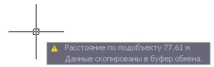

# Измерение длины по подобъекту

Функция предназначена для измерения расстояний по текущему подобъекту между заданными точками.

Для этого:

1. Выберите меню **План - Утилиты - Показать расстояние по подобъекту**. Курсор примет форму прицела и к текущему подобъекту будет осуществляться привязка.
2. Укажите левой кнопкой на подобъекте начальную и конечную точку измеряемого участка.

В результате, программа выведет информацию в поле динамической строки и скопирует данные в буфер обмена:

